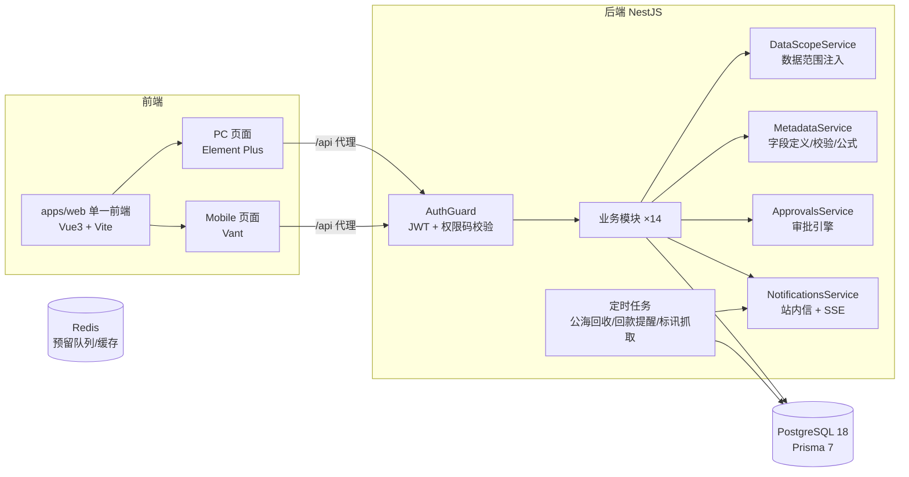
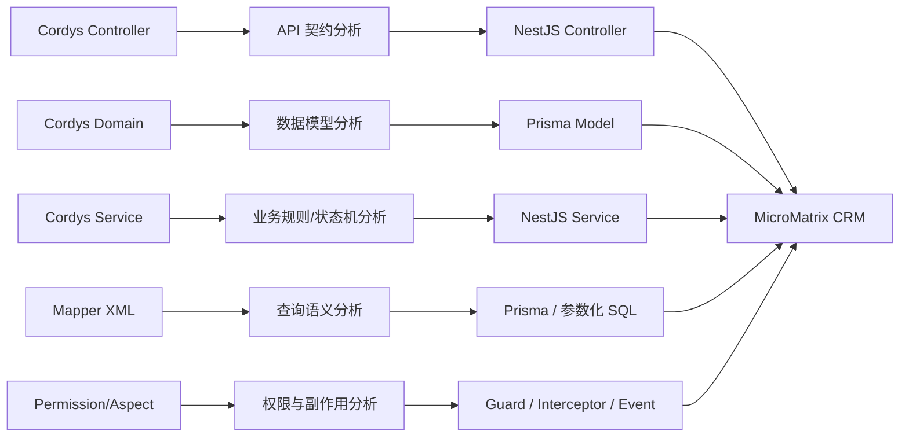

# 架构设计与技术决策记录

## 总体架构

monorepo：`apps/api`（NestJS CJS）、`apps/web`（单一 Vite ESM 前端，内部同时承载 PC + Mobile）、`packages/shared`（前后端共享类型/权限树/公式求值器）。

前端运行时不再维护两个独立应用。`apps/web/src/router/index.ts` 在根路由按当前 viewport 选择布局与页面：桌面宽度加载 `src/views + DefaultLayout`，移动宽度加载 `src/mobile/views + mobile/TabbarLayout`。两端共用同一套 Pinia、JWT token、HTTP 拦截器、Vite 代理与构建产物；Chrome DevTools 切换到手机设备模式后刷新即可进入 Mobile 页面，不设置 `?client=` 一类调试路由参数。

## CordysCRM 语义迁移架构

`CordysCRM/` 是项目内的功能参考基准，不作为 MicroMatrix CRM 的运行时依赖。后续开发采用“业务语义迁移”，而不是 Java 源码逐行翻译。

当前执行记录见 [CordysCRM Wave 2 执行计划](./cordys-wave2-execution-plan.md)：W2.1 顶部导航与 W2.2 跟进计划均已按源码优先流程完成验收。

迁移边界：

- 保留 MicroMatrix CRM 现有 NestJS + Prisma + PostgreSQL + Redis 技术栈。
- Cordys 的 Spring、MyBatis、Shiro、缓存与调度框架不进入运行时。
- API URL 不要求机械保持一致，但业务能力、状态变化、权限语义应有明确对照。
- 对 Cordys 中可复用的抽象能力，优先在 MicroMatrix 建立 NestJS 原生公共模块，不复制 Java 继承体系。
- Cordys 自身的产品授权/版本区分机制不属于 MicroMatrix 的业务需求。
- 对直接复用或翻译的上游代码必须遵守其许可证；若目标是未来独立闭源商业发行，应采用基于功能规格和行为的独立实现方式。

功能状态统一记录在 [cordys-parity.md](./cordys-parity.md)。当前实施顺序以最新的阶段执行计划为准；现阶段为 [cordys-wave1-remainder-plan.md](./cordys-wave1-remainder-plan.md)。

## 关键设计决策（ADR）

### ADR-1 多租户：共享库 + tenantId 行级隔离

- 除 `plans` 外全部业务表带 `tenantId`，服务层查询显式过滤；内部阶段单租户运行，商业化开放注册即可
- 升级路径：PostgreSQL RLS 强制隔离（防止应用层漏加条件）→ 大客户独立 schema
- 注册流程即租户自助开通（租户+根部门+管理员角色+试用订阅，事务内完成）

### ADR-2 数据范围：ownerId + deptId 双列 + 统一注入

- 五级范围：全部 / 本部门及下级 / 本部门 / 仅本人 / 自定义部门；任何范围下本人负责的数据始终可见
- 自定义部门保存所选部门根 ID，查询和单资源鉴权均展开为“所选部门 + 全部下级部门”，不得只匹配直接部门
- 业务表约定 `ownerId`（负责人）与 `deptId`（负责人当时部门，负责人变更时同步），`DataScopeService.scopeFilter(user)` 返回 where 片段由各服务合并
- 池/公海（inPool/inSea）内数据对全员开放，不走数据范围
- 角色保存时只接受 shared canonical 权限树中的权限码；动作权限自动补齐菜单/READ 祖先，非超级管理员不得授予超过自身的功能或数据范围
- `UserRole` 多对多承载成员角色；Guard 每次请求加载全部角色，功能权限取并集。`DataScopeService` 接收明确业务权限码，仅合并拥有该权限的角色范围，防止无关角色扩大动作数据边界

### ADR-3 元数据引擎：固定核心列 + customData JSONB

- 每个业务对象保留参与索引/关联/统计的固定列（name/amount/状态/ownerId 等），扩展字段值统一存 `customData` JSONB
- `FieldDefinition` 单表承载：字段类型（17 种）、必填、选项、公式、表单栅格、列表列配置；系统字段（system=true）不可删、类型不可改，首访按模板自动初始化
- 系统字段允许 `cf_` 前缀（如线索的 cf_source）：定义受保护但值存 JSONB，选项可编辑
- 公式字段：安全递归下降解析器（shared/metadata.ts，禁 eval），三端同一实现；保存时不落库、展示时求值
- 筛选：系统列直接 where；cf_ 走 Prisma JSON path 过滤（equals/string_contains/gt 等）
- 取舍：跨自定义字段的唯一性/联合索引不支持；列表按 customData 排序暂不支持

### ADR-4 审批引擎：快照 + 任务表驱动

- 提交时冻结流程配置到 `nodesSnapshot`（后续改流程不影响在途审批）
- 节点审批人运行时解析（指定成员/角色/部门主管/直属上级）；解析为空的节点自动跳过；全部跳过=自动通过
- 会签（ALL）全员通过进入下一节点；或签（ANY）任一通过、同节点其余任务置 SKIPPED
- 业务挂接双保险：启用流程后直接生效操作被服务层拦截；审批通过由引擎回调 `effectApproved` 自动生效（报价→已确认、合同→履约中）；回款金额仅统计 NONE/APPROVED
- 金额触发条件（amountGte）之下的单据无需审批

### ADR-5 标讯：Provider 适配器

- `BiddingProvider` 接口（key/label/requiresCredentials/fetch），`BiddingService` 构造函数注册表
- 去重指纹 hash = 标题+发布日期，`@@unique([tenantId, hash])` 兜底
- 内置 DemoProvider + 手动录入即最终范围；商业标讯 API（剑鱼/千里马等）明确不做

### ADR-6 通知：站内信 + SSE

- 落库 + 在线推送（每用户多页签 Subject 集合）；EventSource 无法带 Header，stream 端点用 query token 手动校验
- 触发点：分配 / 审批 / 回款到期 / 公海回收；渠道扩展（邮件/webhook）预留在 NotificationsService 单点

### ADR-7 定时任务：@nestjs/schedule 而非 BullMQ

- 内部规模下 cron 足够（公海回收 2:30 / 标讯抓取 8:00 / 回款提醒 9:00），零额外基础设施
- Redis 已在 compose 就绪，大批量导入导出等重任务时引入 BullMQ

### ADR-8 CordysCRM：功能基准 + 语义迁移

- `CordysCRM/` 用于确认真实业务规则、状态机、接口语义、数据关系和前端交互，不作为生产依赖。
- 每个模块迁移前必须同时检查 Controller / Service / Domain / DTO / Mapper XML；只看页面或只看 Controller 均不足以定义需求。
- Java Service 中的事务和副作用需要显式映射到 Prisma transaction、通知、日志、审批和任务机制。
- MyBatis XML 是高级筛选、统计、权限条件和列表行为的重要事实来源；复杂查询不能只依据 Domain 类推断。
- 对已有 MicroMatrix 实现优先做差异重构，不重复建立第二套平行模块。
- 迁移完成标准是业务一致性和自动化测试通过，不是代码行数或文件数量一致。

## 踩坑记录（环境与版本）

| 问题 | 结论 |
| --- | --- |
| postgres:18 镜像启动崩溃 | 18+ 数据卷挂载点从 `/var/lib/postgresql/data` 改为 `/var/lib/postgresql`（官方为支持 pg_upgrade 的破坏性变更） |
| Prisma 7 大版本变化 | 连接串移至 `prisma.config.ts`；生成器 `prisma-client` 输出 TS 源码到 `src/generated`；运行时必须驱动适配器（`@prisma/adapter-pg`）；`migrate dev` 不再自动 generate |
| Prisma 生成代码被 Node 误判 ESM | CJS 工程必须在生成器声明 `moduleFormat = "cjs"`，否则生成代码含 `import.meta` 触发 Node 语法检测崩溃 |
| TypeScript 版本 | npm latest 已是 TS7（原生编译器），typescript-eslint 等生态支持上限 <6.1，全仓固定 `~6.0.x`；TS6 移除 `baseUrl`、`moduleResolution: node10`，需用 NodeNext/Bundler |
| nest build 静默失败 | 与 TS6 组合下出现清空 dist 却不发射的情况，api 构建改为原生 `tsc -p tsconfig.build.json`，dev 用 `tsc -w` + `node --watch` |
| 共享包 CJS 在 Vite dev 白屏 | dev 模式对 workspace 软链包不做 CJS 预构建，浏览器按 ESM 解析命名导出失败；解法：`apps/web` 的 Vite alias 直接指向 `packages/shared/src/index.ts`（源码引用，附带热更新），API 继续用 CJS 产物 |
| PC/Mobile 单工程 | `apps/web` 同时注册 Element Plus Resolver 与 Vant Resolver；移动 viewport 启动时再加载 `@vant/touch-emulator`，避免桌面 PC 页面无意义地启用触摸模拟 |
| npm 网络 | 项目级 `.npmrc` 指向 npmmirror 镜像源 |

## 安全基线

- JWT access 15 分钟 + refresh 7 天（无状态刷新，撤销升级路径：refresh token 落库）
- 全局 AuthGuard：@Public 白名单外一律鉴权；@RequirePermissions 声明式权限码校验
- 密码 bcryptjs(10)；登录成功/失败均记录登录日志（IP/UA）
- 待补齐（见 roadmap）：自助改密、失败锁定、密码策略
