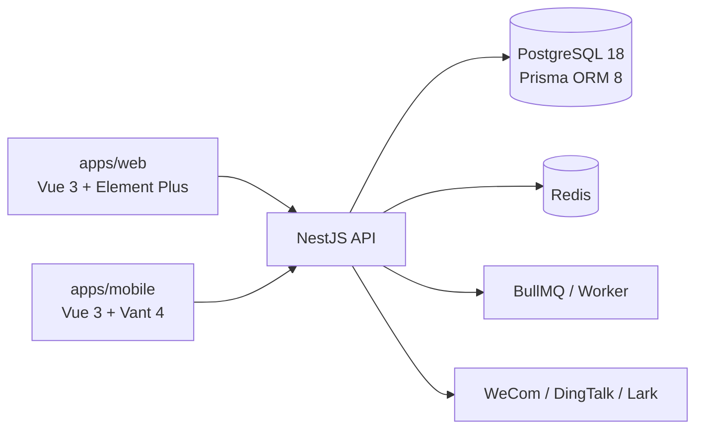

# 架构设计与技术决策记录

## 1. 当前系统边界

当前 `master` 是通用招生 CRM，不再是完整销售交易链 CRM。核心业务主线为线索进入、池化与分配、跟进、转客户、客户持续跟进，以及外部财务事件驱动的客户结果更新。


```mermaid
flowchart LR
  PC[apps/web\nVue 3 + Element Plus] --> API[NestJS API]
  M[apps/mobile\nVue 3 + Vant 4] --> API
  API --> PG[(PostgreSQL 18\nPrisma ORM 8)]
  API --> R[(Redis)]
  API --> W[BullMQ / Worker]
  API --> EXT[WeCom / DingTalk / Lark]
```

Monorepo 主要边界：

- `apps/api`：NestJS API、独立 worker、Prisma ORM 8 runtime 与 migration contract。
- `apps/web`：PC 管理端，Element Plus。
- `apps/mobile`：独立 Mobile H5，Vant 4 + UnoCSS presetWind4，生产路径 `/mobile/`。
- `packages/shared`：前后端共享 DTO、枚举、权限和纯领域逻辑。
- `packages/frontend-shared`：PC / Mobile 共用的 HTTP、token、设备判断和浏览器侧基础能力。

## 2. 当前业务域

主产品只保留真实运行入口与对应数据模型：

- 线索：线索池、负责人、阶段、判重、SLA、导入导出、转客户。
- 客户：客户、公海、联系人、负责人历史、跟进记录与跟进计划。
- 元数据：模块表单、动态字段、Field / Blob 值、表单联动与字段权限。
- 首页：渠道、阶段漏斗、负责人/部门统计等招生分析。
- 外部事件：API Key 调用、严格字段匹配、幂等 Inbox、客户更新或 Lead 自动转换。
- 协同与平台：审批、通知、公告、组织/角色/成员、日志、企业设置、企业微信/钉钉/飞书。

商机、产品、报价、合同、回款、发票、订单、标讯等旧交易链已从当前产品入口、生产 API 与 Prisma contract 中退出；历史实现由 Git / 备份分支追溯，不在当前架构文档中继续维护。

## 3. Prisma ORM 8

数据库层采用 Prisma ORM 8 contract/runtime，不再使用 Prisma Client class 继承模式。

```text
apps/api/
├── prisma.config.ts
├── migrations/                # 正式 migration graph
└── src/
    ├── prisma/
    │   ├── contract.prisma    # 数据模型唯一事实源
    │   ├── contract.json      # contract emit 产物
    │   ├── contract.d.ts      # contract emit 产物
    │   ├── db.ts              # 进程级 plain-object client
    │   └── seed*.ts
    ├── prisma.service.ts      # NestJS DI wrapper
    └── prisma.module.ts
```

`db.ts` 是应用运行时唯一 client 创建点；API 与 worker 各自在自己的 Node.js 进程中持有一个连接池。NestJS shutdown hooks 负责在进程关闭时统一 `db.close()`。需要多连接语义的数据库测试只在 `src/testing/prisma-test-db.ts` 创建隔离 test client。

Migration graph 固定在 `apps/api/migrations/`，结构变化只追加新的 forward migration。详细规则见 [prisma-migration-policy.md](./prisma-migration-policy.md)。

## 4. 多租户、权限与数据范围

- 业务请求以 tenant 为首要隔离边界，服务查询必须显式保持租户条件。
- RBAC 功能权限由角色权限并集决定；数据范围只合并真正拥有目标权限的角色，避免无关角色扩大数据可见范围。
- 部门范围支持本部门、下级、自定义等展开；负责人/创建人等业务过滤在统一 DataScope 层处理。
- API Key 请求仍进入相同租户和数据范围边界，不因为第三方调用绕过权限模型。

## 5. 动态表单与业务数据

模块表单由 `SysModuleForm / SysModuleField` 等元数据描述。固定业务列负责关联、权限、索引和关键状态；扩展字段通过 Field / FieldBlob 持久化，复杂字段与普通标量字段分开处理。

字段定义、值校验、唯一性、动态筛选、附件 claim、表单联动和跨模块显式 formLink 都由 Metadata 相关服务统一处理。业务服务不得自行复制一套动态字段协议。

## 6. Lead → Customer 与外部财务事件

Lead 转 Customer 不再创建 Opportunity。转换只复制显式配置的 formLink 字段，并保持负责人、来源与转换结果的可审计语义。

外部系统通过 External Event API 使用稳定字段组合进行严格匹配：优先唯一 Customer，未命中再匹配唯一 Lead；多条命中、未知字段或空条件均 fail-closed。事件使用 Inbox 保存幂等键、payload 摘要、attempts 与最终状态，避免财务系统重试造成重复转换或重复更新。

## 7. Redis、通知与异步任务

- PostgreSQL 始终是业务真相源；Redis 只承载派生缓存、Pub/Sub 实时信号、分布式协调和 BullMQ delivery metadata。
- Redis 故障时普通缓存与实时通知可以降级；需要 durable queue 的异步导出不能伪装成功，enqueue 失败明确返回错误。
- BullMQ job 只携带轻量任务标识，真实导出参数和状态存 PostgreSQL `ExportTask`；worker 可根据数据库 PENDING 状态恢复缺失 job。
- 通知先落库再做 SSE / 企业消息投递，跨实例实时信号丢失不会造成通知数据丢失。

## 8. 企业集成

企业微信、钉钉、飞书使用统一的企业集成配置边界，Secret 只以加密形态持久化且不在 API 响应中回显。组织同步和 SSO 都必须绑定 tenant，并保持 OAuth state 一次性消费、防重放和本地成员映射。

企业微信工作台入口在企业微信容器内走静默授权链；Mobile 页面通过 `wxwork` 等环境判断隐藏不适合工作台容器的重复 Header。真实企业微信客户端运行态仍属于发布前验收项。

## 9. 发布边界

生产发布使用三类镜像：API、Migration、Web。Web 镜像同时打包 `apps/web/dist` 与 `apps/mobile/dist`；worker 复用 API 镜像执行 `dist/worker.js`。Migration 镜像是数据库结构变更与 bootstrap Seed 的唯一生产入口。

生产拓扑、代理层数和 release smoke 见 [docker-release.md](./docker-release.md)。

## 10. Cordys 参考原则

`CordysCRM/` 只作为业务语义和交互参考，不作为运行时依赖。继续维护的能力可以参考其 Controller / Service / Domain / Mapper / PC / Mobile 行为；但当前产品边界由招生 CRM 规格和现有代码决定，不再为了追求完整 Cordys 模块数量恢复已删除的交易链。

## 11. 工程基线

- Node.js：`>=25 <26`。
- pnpm：`11.25.0`。
- TypeScript：`7.0.2`；Vue typecheck 使用仓库 `tools/vue-tsc.mjs` 兼容脚本。
- API：NestJS 11 + Prisma ORM 8 PostgreSQL runtime。
- PC：Vue 3 + Vite + Element Plus。
- Mobile：Vue 3 + Vite + Vant 4 + UnoCSS presetWind4。
- 提交前至少执行对应范围 typecheck、tests、build、ESLint 和 `git diff --check`。

## 12. 安全基线

- 全局 AuthGuard，只有显式 `@Public` 路由跳过鉴权。
- JWT / API Key 都必须进入 tenant、功能权限与数据范围检查。
- 密码使用 bcrypt；登录行为记录审计日志。
- 企业集成 Secret 使用 AES-256-GCM 等项目既有加密边界，不允许日志或接口回显明文。
- Webhook、外部 URL 和企业 Provider 请求保持现有 SSRF、Header 与错误分类约束。
