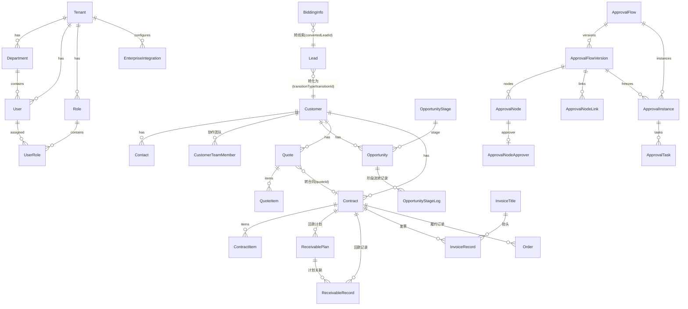

# 数据模型说明

> 完整定义见 [apps/api/prisma/schema.prisma](../apps/api/prisma/schema.prisma)。除 `plans` 外所有业务表带 `tenantId`；业务对象表统一携带 `ownerId`（负责人）、`deptId`（归属部门，数据范围依据）、`customData`（JSONB 自定义字段值）。

## 核心实体关系



## 表清单与要点

### 平台底座

| 表                                      | 要点                                                                                                                                                                   |
| --------------------------------------- | ---------------------------------------------------------------------------------------------------------------------------------------------------------------------- |
| tenants                                 | 租户；status 控停用                                                                                                                                                    |
| departments                             | 树形（parentId 自关联）+ leaderId 部门主管（审批"部门主管"策略依据）                                                                                                   |
| users                                   | email 全局唯一登录；deptId/leaderId（直属上级，逐级审批依据）；DISABLED 停用；不再存单角色外键                                                                         |
| roles                                   | permissions 权限码数组（'*' 全权）；dataScope 五级 + scopeDeptIds；isSystem 内置不可改删                                                                               |
| user_roles                              | 用户—角色多对多关联；`@@unique([userId, roleId])`；角色删除仅级联删除关联，不删除成员                                                                                  |
| operation_logs / login_logs             | 审计；操作日志由拦截器按 @LogOperation 元数据写入                                                                                                                      |
| notifications                           | 站内信；readAt 未读判定；type+link 驱动前端跳转；W2.4 事件编码用于发送门控但暂不冗余落库                                                                               |
| message_task_settings                   | W2.3/W2.4 租户级消息事件覆盖：`@@unique([tenantId, module, event])`；系统/邮件开关与时间、成员、角色、负责人上级范围 JSONB；未落库事件合并 shared 固定目录默认值       |
| system_settings                         | 租户级 KV（企业名称/公告等）                                                                                                                                           |
| enterprise_integrations                 | W3.1 企业集成配置；`@@unique([tenantId, provider])`；企微 `corpId/agentId`、AES-256-GCM 密文/IV/AuthTag/密钥版本、连接测试结果和同步预留状态，不存储或回显 Secret 明文 |
| module_configs / top_navigation_configs | 租户级左侧业务模块启停/排序与顶部公共入口排序；顶部表保留 Cordys `enabled` 兼容字段，但当前产品边界只开放列表和完整排序                                                |
| attachments                             | 附件挂载（targetType+targetId）；本地磁盘上传已落地                                                                                                                    |
| export_tasks                            | R2 导出任务中心；记录创建者、业务模块、状态、文件路径、行数、大小与 24h 过期时间                                                                                       |

W3.1 新增企业集成账号与安全凭据模型；组织同步映射、OAuth 外部身份和第三方消息投递模型仍分别由 DB-013、DB-014、DB-006 跟踪。连同合同作废/归档、发票审批、创建人审计、回款计划负责人及高级审批缺口，都必须以 [Cordys 暂缓能力与数据模型缺口台账](./cordys-deferred-backlog.md) 为完成前检查清单。

### 元数据引擎

| 表                | 要点                                                                                                                                                                                                                                                                                                     |
| ----------------- | -------------------------------------------------------------------------------------------------------------------------------------------------------------------------------------------------------------------------------------------------------------------------------------------------------- |
| field_definitions | `@@unique([tenantId, module, key])`；system 字段不可删/类型不可改；options/config JSONB；sort/span 表单布局；showInList/listWidth 列表配置。公式字段 `config.formula` 由 shared 求值器计算；R4 新增 `config.unique`，当前用于客户 name/phone/email 与联系人 name/phone 的 Cordys `rules.unique` 等价语义 |

### 销售核心

| 表                                                                      | 要点                                                                                                                                                                                                                                          |
| ----------------------------------------------------------------------- | --------------------------------------------------------------------------------------------------------------------------------------------------------------------------------------------------------------------------------------------- |
| leads                                                                   | `inPool + poolId` 多线索池；池可按成员/部门 Scope 隔离；status FOLLOWING/CONVERTED/INVALID；`transitionType + transitionId` 保存真实转换目标（客户转换时 CUSTOMER + customerId）；collectedAt/poolEnteredAt/lastFollowedAt 支撑领取和回收规则 |
| customers                                                               | `inSea + poolId` 多公海；collectedAt/poolEnteredAt/lastFollowedAt；公海 Scope、领取/回收/库容规则                                                                                                                                             |
| contacts                                                                | 挂客户，onDelete Cascade；Cordys 核心字段 `customerId/ownerId/name/phone/enable/disableReason`，扩展字段走 `customData`；`ownerId/deptId` 支撑联系人独立数据范围与客户协作子域                                                                |
| customer_team_members                                                   | 客户协作关系 `@@unique([customerId, userId])`；`collaborationType=READ_ONLY/COLLABORATION`                                                                                                                                                    |
| customer_relations                                                      | 集团/子公司有向关系：source=集团、target=子公司；服务层保证一个子公司只有一个上级集团并阻止循环关系                                                                                                                                           |
| follow_up_records                                                       | 多态跟进（targetType: lead/customer/opportunity/contract）；写入时回填目标 lastFollowedAt                                                                                                                                                     |
| follow_up_plans                                                         | 多态计划（lead/customer/opportunity）；四态状态机；`convertedRecordId` 保证转记录可追溯，`dueNotifiedAt` 按日期去重提醒；负责人/部门快照参与数据范围                                                                                          |
| opportunity_stages                                                      | 可配置阶段；isWon/isLost 系统结果阶段不可删；probability 赢率                                                                                                                                                                                 |
| opportunities                                                           | stageId + wonAt/lostAt/lostReason；可空 `contactId` 绑定当前客户联系人；金额 Decimal(14,2)；`opportunity_items` 产品明细（级联删除）                                                                                                          |
| resource_pools / resource_pool_pick_rules / resource_pool_recycle_rules | 多池、Scope、池管理员、领取限制与 Cordys 时间条件自动回收                                                                                                                                                                                     |
| resource_capacities                                                     | 线索/客户库容；客户支持过滤条件排除不计入库容的数据                                                                                                                                                                                           |
| resource_owner_histories                                                | Lead/Customer 历史负责人、进入池原因与时间                                                                                                                                                                                                    |
| pool_rules                                                              | 旧单规则兼容模型；仅当对应模块没有有效新自动回收条件时作为 recycleDays/notifyDays fallback                                                                                                                                                    |

### 用户视图

| 表                    | 要点                                                                                                      |
| --------------------- | --------------------------------------------------------------------------------------------------------- |
| saved_views           | 用户个人保存视图：module/name/fixed/enabled/sort/searchMode；`@@unique([tenantId, userId, module, name])` |
| saved_view_conditions | SavedView 条件：field/operator/value/fieldType/multipleValue/containChildIds/sort；删除视图时级联删除     |

### 交易链路

| 表                               | 要点                                                                                                                                                                     |
| -------------------------------- | ------------------------------------------------------------------------------------------------------------------------------------------------------------------------ |
| products                         | ON/OFF 上下架；price/cost Decimal                                                                                                                                        |
| quotes + quote_items             | code `@@unique([tenantId, code])`；totalAmount 服务端按明细重算；status DRAFT/CONFIRMED/VOID + approvalStatus                                                            |
| contracts + contract_items       | 支持 fromQuoteId 复制明细；status DRAFT/EXECUTING/COMPLETED/TERMINATED + approvalStatus；paidAmount/invoicedAmount 为 VO 层聚合（回款仅计 approvalStatus NONE/APPROVED） |
| receivable_plans                 | period 期次自增；状态（PENDING/PARTIAL/PAID/OVERDUE）由记录汇总动态计算不落库                                                                                            |
| receivable_records               | planId 可选关联；approvalStatus 参与金额统计门槛                                                                                                                         |
| invoice_titles / invoice_records | 工商抬头（可关联客户或通用）；发票 PENDING/ISSUED/VOID                                                                                                                   |
| orders                           | 关联生效合同；状态机 PENDING→DELIVERING→ACCEPTED→COMPLETED / CANCELED（流转表在 shared ORDER_STATUS_FLOW）                                                               |

### 客户 360 投影视图（R5）

客户 360 不新增独立汇总表，以 `customers.id` 为根按现有业务关系读取：

```text
Customer
├── Contact
├── FollowUpRecord(targetType=customer)
├── FollowUpPlan(targetType=customer)
├── ResourceOwnerHistory(module=customer)
├── CustomerRelation
├── CustomerTeamMember
├── Opportunity
└── Contract
    ├── ReceivablePlan
    ├── ReceivableRecord
    ├── InvoiceRecord
    └── Order
```

`GET /customers/:id/related` 仅保留轻量/兼容聚合；商机、合同、回款、发票、订单的大列表由 `/customers/:id/360/:resource` 分页读取。所有读取先经过 `CustomerAccessService`，再叠加对应业务模块权限，避免 Customer 360 成为跨模块数据权限旁路。

W2.2 已把 `FollowUpPlan` 接入 PC/Mobile 客户 360。指定客户读取仍先经过 `CustomerAccessService`；只读协作人只能看到自己创建的计划，协作写关系可新建计划。

### 审批引擎

| 表                            | 要点                                                                                                                                                                     |
| ----------------------------- | ------------------------------------------------------------------------------------------------------------------------------------------------------------------------ |
| approval_flows                | 主记录：租户内可读编号、`quotation/contract/invoice/order` 表单类型、当前版本、三种执行时机、更多设置、金额入口条件、启停、软删除和创建/更新审计；未删除表单类型部分唯一 |
| approval_flow_number_counters | 按租户和表单类型原子分配编号序号，前缀为 `QTE/CTR/INV/ORD-APV`                                                                                                           |
| approval_flow_versions        | 不可变版本；`@@unique([flowId, version])`，流程主表通过 `currentVersionId` 指向当前版本                                                                                  |
| approval_nodes                | 版本内基础节点：编号、名称、START/APPROVER/END（预留 CONDITION/DEFAULT）、CREATE/UPDATE/DELETE 执行时机与顺序                                                            |
| approval_node_approvers       | 审批节点一对一扩展；策略 USER/ROLE/DEPT_LEADER/DIRECT_LEADER，`approverIds` 与 ALL 会签 / ANY 或签                                                                       |
| approval_node_links           | 版本内有向连接；保存起点、终点和顺序。W2.5 页面和服务只生成唯一合法的线性图                                                                                              |
| approval_instances            | 绑定 `flowId/flowVersionId/executeTiming`，并保留 `nodesSnapshot` 冻结提交时配置；`currentNodeIndex` 为运行游标                                                          |
| approval_tasks                | 按快照节点批量生成；`@@index([tenantId, approverId, status])` 支撑待办查询                                                                                               |

旧报价/合同/订单配置迁移为版本 1 并补开始/结束节点及连接；旧实例快照不改写。原回款记录流程被停用并软删除，新提交入口关闭，历史实例与任务继续可读。条件节点、高级审批任务、字段权限和 Webhook 模型分别由 DB-010～DB-012 跟踪。

### 标讯

| 表                   | 要点                                                                             |
| -------------------- | -------------------------------------------------------------------------------- |
| bidding_sources      | 每租户每 provider 一条；credentials JSONB 凭证；enabled 参与抓取                 |
| bidding_keyword_subs | 关键词订阅                                                                       |
| bidding_infos        | hash=标题+发布日期 `@@unique([tenantId, hash])` 去重；convertedLeadId 防重复转化 |

### 商业化预留（未启用）

| 表                    | 要点                                                   |
| --------------------- | ------------------------------------------------------ |
| plans / subscriptions | 套餐与订阅；注册时自动挂 free 试用；内部阶段无计费逻辑 |

## 金额与时间约定

- 金额一律 `Decimal(14,2)`（预算类 16,2），VO 层 `Number()` 转换；汇总计算四舍五入两位
- 日期字段 VO 输出 `YYYY-MM-DD`，时间戳输出 ISO 字符串；前端展示用 `toLocaleString()`

## 待新增表（见 roadmap）

- 业务字段 diff 当前复用 `operation_logs.detail.changes`，不再单独规划 `change_logs`，避免维护两套审计事实源
- `sales_targets`（业绩目标）
- `tags` / `customer_tags`（客户标签）
- 软删除：核心对象加 `deletedAt`（回收站）
