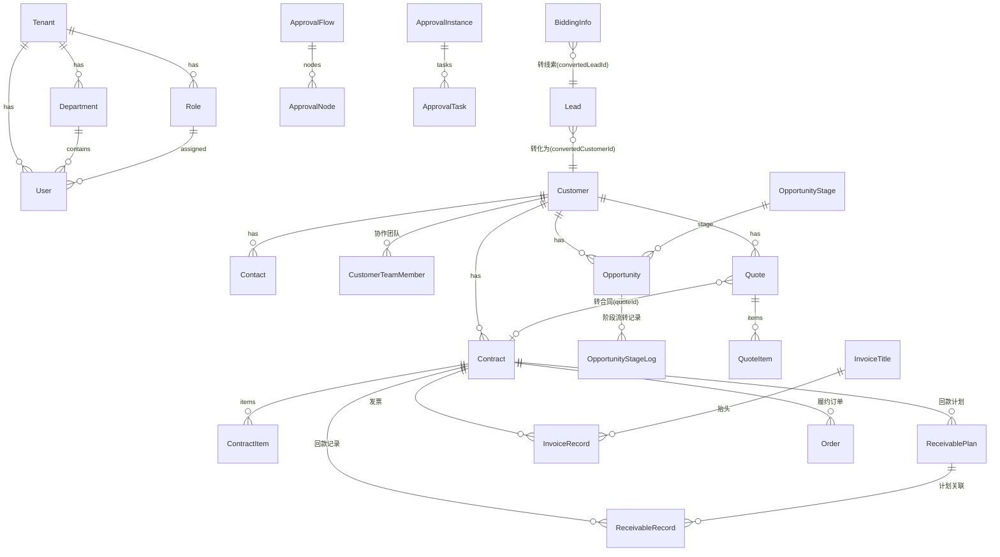

# 数据模型说明

> 完整定义见 [apps/api/prisma/schema.prisma](../apps/api/prisma/schema.prisma)。除 `plans` 外所有业务表带 `tenantId`；业务对象表统一携带 `ownerId`（负责人）、`deptId`（归属部门，数据范围依据）、`customData`（JSONB 自定义字段值）。

## 核心实体关系

## 表清单与要点

### 平台底座

| 表 | 要点 |
| --- | --- |
| tenants | 租户；status 控停用 |
| departments | 树形（parentId 自关联）+ leaderId 部门主管（审批"部门主管"策略依据） |
| users | email 全局唯一登录；roleId/deptId/leaderId（直属上级，逐级审批依据）；DISABLED 停用 |
| roles | permissions 权限码数组（'*' 全权）；dataScope 五级 + scopeDeptIds；isSystem 内置不可改删 |
| operation_logs / login_logs | 审计；操作日志由拦截器按 @LogOperation 元数据写入 |
| notifications | 站内信；readAt 未读判定；type+link 驱动前端跳转 |
| system_settings | 租户级 KV（企业名称/公告等） |
| attachments | 附件挂载（targetType+targetId）；**上传实现待补**（roadmap P0） |

### 元数据引擎

| 表 | 要点 |
| --- | --- |
| field_definitions | `@@unique([tenantId, module, key])`；system 字段不可删/类型不可改；options/config JSONB；sort/span 表单布局；showInList/listWidth 列表配置。公式字段 config.formula 由 shared 求值器三端计算 |

### 销售核心

| 表 | 要点 |
| --- | --- |
| leads | inPool 线索池（池内对全员开放，不走数据范围）；status FOLLOWING/CONVERTED/INVALID；lastFollowedAt 供回收判定 |
| customers | inSea 公海；lastFollowedAt；查重（roadmap P0）拟基于 name/phone |
| contacts | 挂客户，onDelete Cascade |
| customer_team_members | 协作团队 `@@unique([customerId, userId])` |
| follow_up_records | 多态跟进（targetType: lead/customer/opportunity/contract）；写入时回填目标 lastFollowedAt |
| opportunity_stages | 可配置阶段；isWon/isLost 系统结果阶段不可删；probability 赢率 |
| opportunities | stageId + wonAt/lostAt/lostReason；金额 Decimal(14,2) |
| pool_rules | 每租户每模块一条（lead/customer）；recycleDays/notifyDays 驱动凌晨回收 cron |

### 交易链路

| 表 | 要点 |
| --- | --- |
| products | ON/OFF 上下架；price/cost Decimal |
| quotes + quote_items | code `@@unique([tenantId, code])`；totalAmount 服务端按明细重算；status DRAFT/CONFIRMED/VOID + approvalStatus |
| contracts + contract_items | 支持 fromQuoteId 复制明细；status DRAFT/EXECUTING/COMPLETED/TERMINATED + approvalStatus；paidAmount/invoicedAmount 为 VO 层聚合（回款仅计 approvalStatus NONE/APPROVED） |
| receivable_plans | period 期次自增；状态（PENDING/PARTIAL/PAID/OVERDUE）由记录汇总动态计算不落库 |
| receivable_records | planId 可选关联；approvalStatus 参与金额统计门槛 |
| invoice_titles / invoice_records | 工商抬头（可关联客户或通用）；发票 PENDING/ISSUED/VOID |
| orders | 关联生效合同；状态机 PENDING→DELIVERING→ACCEPTED→COMPLETED / CANCELED（流转表在 shared ORDER_STATUS_FLOW） |

### 审批引擎

| 表 | 要点 |
| --- | --- |
| approval_flows | `@@unique([tenantId, module])` 每对象一条流程；condition.amountGte 触发条件 |
| approval_nodes | 审批人策略 USER/ROLE/DEPT_LEADER/DIRECT_LEADER；mode ALL 会签 / ANY 或签 |
| approval_instances | nodesSnapshot 提交时冻结配置；currentNodeIndex 游标；业务对象冗余 approvalStatus 供列表快速展示 |
| approval_tasks | 按节点批量生成；`@@index([tenantId, approverId, status])` 支撑待办查询 |

### 标讯

| 表 | 要点 |
| --- | --- |
| bidding_sources | 每租户每 provider 一条；credentials JSONB 凭证；enabled 参与抓取 |
| bidding_keyword_subs | 关键词订阅 |
| bidding_infos | hash=标题+发布日期 `@@unique([tenantId, hash])` 去重；convertedLeadId 防重复转化 |

### 商业化预留（未启用）

| 表 | 要点 |
| --- | --- |
| plans / subscriptions | 套餐与订阅；注册时自动挂 free 试用；内部阶段无计费逻辑 |

## 金额与时间约定

- 金额一律 `Decimal(14,2)`（预算类 16,2），VO 层 `Number()` 转换；汇总计算四舍五入两位
- 日期字段 VO 输出 `YYYY-MM-DD`，时间戳输出 ISO 字符串；前端展示用 `toLocaleString()`

## 待新增表（见 roadmap）

- `change_logs`（对象操作历史，字段级 diff）
- `sales_targets`（业绩目标）
- `tags` / `customer_tags`（客户标签）
- 软删除：核心对象加 `deletedAt`（回收站）
