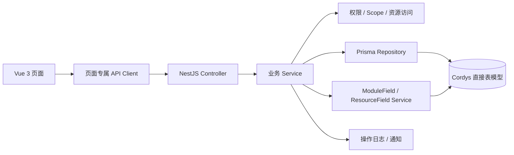

# W3.4 图中业务模块逐页对齐技术设计

> 状态：已确认（2026-08-25）

## 1. 设计目标与约束

本设计落实已确认的 [W3.4 需求](./requirements.md)，不开始代码实施。设计目标是把首页、线索/线索池、客户/联系人/公海和仪表板收敛到同一套 Cordys 业务事实，并清除当前项目中与 Cordys 冲突的数据模型、API 和页面。

核心约束：

- `CordysCRM/` 页面、API、Controller、Service、Domain、Mapper 和 DDL 是功能与模型第一事实来源。
- NestJS、Prisma、PostgreSQL、Vue 3、Element Plus 是实现技术，不改变 Cordys 业务关系。
- 当前项目未发布且本地数据可重建；迁移不做旧模型兼容、双字段、双写或历史回填。
- 每个子阶段独立通过迁移、Seed、规则测试、真实数据库 Smoke、类型检查、构建和浏览器验收。
- Cordys License 不实现；DataEase 服务端不内置，但仪表板管理与安全嵌入边界必须完整。

## 2. 总体架构



分层职责：

- **页面层**：只组合真实 API，不计算权限真相、不持久化伪数据。
- **Controller 层**：对齐 Cordys 路径与 DTO，执行参数校验和功能权限。
- **业务 Service**：承载状态、转换、池规则、360、仪表板 Scope 和事务。
- **访问层**：复用已验收的多角色权限并集、数据范围和资源访问裁决。
- **字段层**：以 `sys_module_form/sys_module_field` 描述字段，以业务分域字段表保存动态值。
- **Repository 层**：只访问 W3.4 目标直接模型，不再访问旧通用池、旧 JSON 字段或旧统计 Dashboard。

## 3. W3.4.0 数据模型设计

### 3.1 PostgreSQL 类型映射

Cordys MySQL DDL 到 PostgreSQL 的直接映射规则：

| Cordys 类型 | PostgreSQL / Prisma | 说明 |
| --- | --- | --- |
| `VARCHAR(32/255/...)` | `String @db.VarChar(n)` | 长度按 Cordys DDL 保留 |
| `TEXT/LONGTEXT` | `String @db.Text` | JSON 文本仍按 Cordys 字符串契约保存 |
| `BIT(1)` | `Boolean` | 默认值按 Cordys 保留 |
| `BIGINT` 时间 | `BigInt` | 保存 epoch milliseconds；API 序列化为安全整数 number |
| `DECIMAL` | `Decimal` | 精度按对应 Cordys 表保留 |

所有 W3.4 直接业务表使用 `organizationId` 作为组织字段。鉴权上下文中的现有 `tenantId` 在请求边界解析为同一组织 ID；目标表中不同时保留 `tenantId + organizationId` 两套字段。

### 3.2 公共表单与字段配置

当前 `field_definitions` 由以下直接模型替换：

| Prisma 目标模型 | 表 | 核心字段 |
| --- | --- | --- |
| `SysModuleForm` | `sys_module_form` | `id/formKey/organizationId/createUser/updateUser/createTime/updateTime` |
| `SysModuleFormBlob` | `sys_module_form_blob` | `id/prop` |
| `SysModuleField` | `sys_module_field` | `id/formId/name/internalKey/type/mobile/pos/audit` |
| `SysModuleFieldBlob` | `sys_module_field_blob` | `id/prop` |

`prop` 保存 Cordys 字段规则、选项、显示、校验、布局和列表配置。`MetadataService` 改为适配这些直接表，并继续向 Web 返回稳定的 `FieldVO` 展示契约；这只是输出 DTO 转换，不保留旧数据库模型。

动态字段值不再写入业务表 `customData`：

- ≤255 字符的规范化值写普通字段表；
- 大文本、复杂数组或序列化对象写对应 `_field_blob`；
- 一个资源/字段只能存在一个当前值，保存时在同一事务内删除旧值再写入目标表；
- 列表、详情、导出和公式计算统一经 `ResourceFieldValueService` 装配；
- 高级筛选按字段类型选择主表、普通字段表或 Blob 限制策略，不能把所有查询退化为内存过滤。

### 3.3 用户视图

当前 `saved_views/saved_view_conditions` 由以下直接模型替换：

| Prisma 目标模型 | 表 | 核心字段 |
| --- | --- | --- |
| `SysUserView` | `sys_user_view` | `userId/name/fixed/enable/resourceType/organizationId/pos/searchMode/audit` |
| `SysUserViewCondition` | `sys_user_view_condition` | `sysUserViewId/name/value/valueType/type/multipleValue/operator/childrenValue/audit` |

页面继续使用各资源路径下的 View API。`resourceType` 使用 Cordys 资源枚举；系统视图不伪装成用户视图，不入 `sys_user_view`。

### 3.4 线索直接模型

| Prisma 目标模型 | 表 | 替换/删除 |
| --- | --- | --- |
| `Clue` | `clue` | 替换 `Lead/leads`；使用 `name/owner/stage/lastStage/contact/phone/products/organizationId/collectionTime/inSharedPool/transitionType/transitionId/follower/followTime/poolId/reasonId/audit` |
| `ClueField` | `clue_field` | 替换 Clue `customData` 普通值 |
| `ClueFieldBlob` | `clue_field_blob` | 替换 Clue `customData` 大文本值 |
| `ClueOwner` | `clue_owner` | 替换通用 `ResourceOwnerHistory(module=lead)` |
| `CluePool` | `clue_pool` | 替换通用 `ResourcePool(module=lead)` |
| `CluePoolHiddenField` | `clue_pool_hidden_field` | 替换 `hiddenFieldIds[]` |
| `CluePoolPickRule` | `clue_pool_pick_rule` | 替换通用 Pick Rule |
| `CluePoolRecycleRule` | `clue_pool_recycle_rule` | 替换通用 Recycle Rule |
| `ClueCapacity` | `clue_capacity` | 替换通用 Capacity |

`LeadStatus` 删除。线索进度以 Cordys `stage/lastStage` 为唯一状态事实；是否已转客户继续由 `transitionType/transitionId` 判断。

### 3.5 客户域直接模型

| Prisma 目标模型 | 表 | 替换/删除 |
| --- | --- | --- |
| `Customer` | `customer` | 原 plural 表直接替换；使用 Cordys owner/collection/pool/follower/follow 字段及 BaseModel 审计 |
| `CustomerField/CustomerFieldBlob` | `customer_field/customer_field_blob` | 替换 Customer `customData` |
| `CustomerOwner` | `customer_owner` | 替换通用 `ResourceOwnerHistory(module=customer)` |
| `CustomerContact` | `customer_contact` | 替换 `Contact/contacts`；按 1.2.3 最终 DDL，`customerId` 允许为空 |
| `CustomerContactField/Blob` | `customer_contact_field/customer_contact_field_blob` | 替换 Contact `customData` |
| `CustomerCollaboration` | `customer_collaboration` | 替换 `CustomerTeamMember/customer_team_members` |
| `CustomerRelation` | `customer_relation` | 原 plural 表直接替换 |
| `CustomerPool` | `customer_pool` | 替换通用 `ResourcePool(module=customer)` |
| `CustomerPoolHiddenField` | `customer_pool_hidden_field` | 替换 `hiddenFieldIds[]` |
| `CustomerPoolPickRule` | `customer_pool_pick_rule` | 替换通用 Pick Rule |
| `CustomerPoolRecycleRule` | `customer_pool_recycle_rule` | 替换通用 Recycle Rule |
| `CustomerCapacity` | `customer_capacity` | 替换通用 Capacity，并保留 `filter` 文本条件 |

商机、报价、合同、订单等现有模型继续通过 `customerId` 关联 `Customer`；Opportunity 的联系人关系改为 `CustomerContact`。迁移必须一次性更新所有 Prisma relation 和 Service 引用，不能保留 `Contact` 别名模型。

### 3.6 仪表板直接模型

| Prisma 目标模型 | 表 | 关键字段/约束 |
| --- | --- | --- |
| `DashboardModule` | `dashboard_module` | `organizationId/name/parentId/pos/audit`；根节点 `parentId` 使用 Cordys 非空哨兵 `NONE`，同组织同父级名称由 Service 保证唯一 |
| `Dashboard` | `dashboard` | `name/resourceUrl/dashboardModuleId/organizationId/pos/scopeId/description/audit` |
| `DashboardCollection` | `dashboard_collection` | `userId/dashboardId/audit`；用户与仪表板组合唯一 |

首页统计不使用 Dashboard 表。当前 `modules/dashboard` 统计 Service 重命名并迁入 Home 模块，释放 `/api/dashboard` 给 Cordys 仪表板资源 API。

### 3.7 删除清单

W3.4.0 完成后删除以下数据库真相及代码引用：

- `Lead`、`LeadStatus`、`Contact`、`CustomerTeamMember`；
- `FieldDefinition` 与触及模块的 `customData`；
- `SavedView/SavedViewCondition`；
- `ResourcePool/ResourcePoolPickRule/ResourcePoolRecycleRule/ResourceCapacity/ResourceOwnerHistory`；
- 已被多池实现替代的 `PoolRule`；
- `/api/dashboard/summary|funnel|ranking|trend|conversion` 旧统计接口；
- `/reports` 的固定 ECharts 报表实现。

删除必须发生在调用方全部切换的同一个实施阶段，不允许提交一个能编译但同时维护新旧模型的中间版本。

## 4. 后端模块与 API 设计

### 4.1 模块边界

| NestJS 模块 | 职责 |
| --- | --- |
| `ModuleFormsModule` | `sys_module_form/field/blob`、表单配置和字段 DTO |
| `UserViewsModule` | `sys_user_view/condition` 通用 Service，各业务 Controller 绑定资源类型 |
| `CluesModule` | 普通线索 CRUD、转换、跟进引用、负责人历史 |
| `CluePoolsModule` | 线索池配置、领取/分配/回收/库容、池列表 |
| `CustomersModule` | 普通客户、360、协作、关系、合并、负责人历史 |
| `CustomerContactsModule` | 独立联系人和客户内嵌联系人 |
| `CustomerPoolsModule` | 公海配置、领取/分配/回收/库容、公海列表 |
| `HomeModule` | Cordys 首页部门树和统计；组合计划、审批、通知的既有 API |
| `DashboardsModule` | 仪表板目录、资源、Scope、收藏、排序与嵌入配置 |

### 4.2 首页 API

| 方法 | 路径 | Service |
| --- | --- | --- |
| `GET` | `/api/home/statistic/department/tree` | 返回权限裁剪部门树 |
| `POST` | `/api/home/statistic/lead` | 四周期新增线索与环比 |
| `POST` | `/api/home/statistic/opportunity` | 四周期商机数/金额 |
| `POST` | `/api/home/statistic/opportunity/underway` | 四周期进行中商机数/金额 |
| `POST` | `/api/home/statistic/opportunity/success` | 四周期赢单数/金额与环比 |

请求 DTO 直接表达 `deptIds/searchType/timeField/userField/priorPeriodEnable/winOrderTimeField`。每个统计接口按自己的模块读取权限调用 DataScope，不能共用 `menu:dashboard` 的宽泛 Scope。

### 4.3 线索与池 API

API 采用 Cordys 资源路径，不保留旧 `/api/leads` Controller：

- 普通线索：`/api/lead/module/form`、`page`、`get/:id`、`add`、`update`、`status/update`、`delete/:id`、`batch/*`、`to-pool`、`tab`、`chart`、导入导出；
- 转换：`/api/lead/transform`、`transition/account`、`transition/account/page`、`re-transition/account`；
- 线索池：`/api/pool/lead/options`、`page`、`get/:id`、`pick`、`assign`、`batch-*`、`chart`、导入导出；
- 用户视图：`/api/lead/view/*`、`/api/pool/lead/view/*`；
- 设置：`/api/lead-pool/*`、`/api/lead-capacity/*`。

旧前端 `leadApi` 可保留对象名称，但其函数必须指向新路径且使用 Cordys DTO；旧路径和旧 DTO 删除。

### 4.4 客户域 API

- 客户：`/api/account/module/form`、`page`、`get/:id`、`add`、`update`、`delete/:id`、`batch/*`、`to-pool`、`option`、`tab`、`merge/page`、`merge`、`chart`、360 分页资源；
- 联系人：`/api/account/contact/module/form`、`page`、`list/:customerId`、`get/:id`、`add`、`update`、`enable/:id`、`disable/:id`、`delete/:id`、`opportunity/check/:id`、`tab`、导入导出、批量更新；
- 公海：`/api/pool/account/options`、`page`、`get/:id`、`pick`、`assign`、`batch-*`、`chart`、导入导出；
- 用户视图：`/api/account/view/*`、`/api/account/contact/view/*`、`/api/pool/account/view/*`；
- 设置：`/api/account-pool/*`、`/api/account-capacity/*`；
- 协作/关系：继续使用 Cordys `/api/account/collaboration/*`、`/api/account/relation/*` 资源边界。

Web 页面 URL 仍使用 `/customers`、`/contacts` 和 `/customers/open-sea`，只替换页面 API；浏览器路由不是数据库/API 兼容层。

### 4.5 仪表板 API

完整提供 Cordys 路径：

- `/api/dashboard/add|detail/:id|update|rename|delete/:id|page|collect/:id|un-collect/:id|collect/page|edit/pos`；
- `/api/dashboard/module/add|rename|delete|tree|count|move`；
- `/api/system/business/dataease/config` 与 `/token` 仅在配置启用时工作，Secret/token 不下发日志或持久化到 Dashboard。

Dashboard Scope 使用现有 `ScopeResolverService` 解析用户/部门 token。普通管理员只能读取 Scope 命中的资源；系统管理员读取当前组织全部数据。详情、收藏和嵌入同样执行读取检查，不能仅在列表 SQL 中筛选。

## 5. 核心 Service 设计

### 5.1 字段值服务

`ResourceFieldValueService` 提供四个原子操作：

1. `validate(formKey, values, mode)`：使用 `SysModuleField + prop` 校验必填、类型、唯一和联动规则。
2. `save(resourceType, resourceId, values, tx)`：把普通值与 Blob 值写入对应分域表。
3. `load(resourceType, resourceIds)`：批量装配字段值，避免列表 N+1。
4. `buildFilter(resourceType, conditions)`：将视图/高级筛选编译为 Prisma/SQL 条件。

主记录与字段值必须共用事务。批量更新按字段类型写正确表，并在所有目标通过权限与校验后统一提交。

### 5.2 池与负责人历史

Clue 与 Customer 分别实现池 Service，共享无状态的规则计算器，不共享数据库模型：

- 领取事务锁定资源、池规则、当日领取计数和库容 Scope；
- 前负责人冷却读取 `clue_owner/customer_owner`；
- 新数据保护使用进入池时间或 Cordys 对应创建/领取时间语义；
- 转移、领取、分配、手工退池和自动回收统一结束当前负责人并写历史；
- `reasonId` 同时写当前资源和历史记录；
- 自动回收按池逐批执行，使用资源 ID 游标和幂等条件防止重复通知。

PostgreSQL 使用事务与行锁保证并发领取/分配；库容检查和写负责人必须在同一事务内。

### 5.3 首页统计

`HomeStatisticService` 拆成：

- `HomeDepartmentScopeService`：根据目标权限码返回可选部门树；
- `HomePeriodService`：生成 TODAY/THIS_WEEK/THIS_MONTH/THIS_YEAR 及前周期边界；
- `HomeClueStatisticQuery`：按 `CREATE_USER/OWNER` 与 Scope 统计；
- `HomeOpportunityStatisticQuery`：按创建、预计结束、实际结束和阶段场景统计数量/金额。

统计查询只返回聚合值，不加载完整业务记录。点击跳转使用与统计相同的 `HomeFilterPayload` 写入 sessionStorage，并由目标列表一次性读取、验证和转换为真实筛选条件。

### 5.4 客户 360

保留现有已验收的按 Tab 分页策略，但全部入口先调用 `CustomerAccessService.assertRead()`：

- 普通客户：按模块权限裁剪 360 Tab；
- `COLLABORATION`：可写允许的跟进/联系人子域，不提升客户主体管理权；
- `READ_ONLY`：只读；
- 公海客户：只允许信息、跟进记录和负责人历史，后端拒绝其它 360 资源。

Customer/Contact 直接模型切换后，既有关系、合并、转换和 FollowUp Service 必须同批修改，不能通过 DTO 伪造旧 `customData`。

### 5.5 仪表板排序与嵌入

- 文件夹使用 `parentId + pos` 构树；禁止自身/后代移动、孤儿节点和循环。
- 同父级文件夹名唯一、同文件夹仪表板名唯一，由事务内查询与组织级 advisory lock 保证并发一致。
- 删除文件夹前递归确认；确认后事务删除子目录、Dashboard 和收藏。
- Dashboard 移动或排序采用 Cordys 稀疏 `pos`，无可用间隔时重排同范围节点。
- `resourceUrl` 保存前只允许 `https`；开发环境可显式允许 `http://localhost`。
- provider token 由后端按允许的 DataEase origin 获取；前端 iframe 使用精确 `targetOrigin`，校验 `message.origin`，禁止 Cordys 源码中的 `postMessage('*')`。
- CSP `frame-src` 与服务端 allowlist 使用同一配置来源；iframe 失败显示配置入口和可诊断错误，不回退伪图表。

## 6. 权限与审计

技术权限码继续使用当前已验收的小写命名，但语义必须与 Cordys 粒度一一对应；这不是旧接口兼容，而是 NestJS 权限表达：

- 线索：`lead:read/create/update/delete/assign/import/export`；
- 线索池：`leadPool:read/pick/assign/update/delete/import/export`；
- 客户：`customer:read/create/update/delete/assign/import/export/merge/team`；
- 公海：`customerPool:read/pick/assign/update/delete/import/export`；
- 联系人：`contact:read/create/update/delete/import/export`；
- 仪表板：新增 `dashboard:read/create/update/delete`，不再只复用 `menu:dashboard`；
- 首页不新增宽泛业务权限，分别使用目标模块读取权限。

所有写操作进入 OperationLog；负责人、池、转换、合并和仪表板移动额外保存可读差异。收藏属于用户行为，记录轻量审计但不产生业务通知。

## 7. 前端与界面设计规格

### 7.1 设计基线

- **平台**：PC Web 为 W3.4 主目标；现有 Mobile 线索/客户页面做回归，不新增 Mobile 仪表板。
- **方向**：沿用 Cordys 的高信息密度企业工作台，强调表格、分栏、抽屉和可扫描性，不进行品牌化视觉重设计。
- **组件栈**：Vue 3 + Element Plus + UnoCSS；不引入第二套 UI 组件库。
- **色彩**：主色使用 Element Plus 当前 `#409EFF`；成功 `#67C23A`、警告 `#E6A23C`、危险 `#F56C6C`；页面背景 `#F5F7FA`、卡片 `#FFFFFF`、主文字 `#303133`、次文字 `#606266`、边框 `#DCDFE6`。暗色继续由 Element Plus dark variables 驱动。
- **字体**：`Helvetica Neue, Helvetica, PingFang SC, Hiragino Sans GB, Microsoft YaHei, Arial, sans-serif`；正文 14px、辅助 12px、区块标题 16px/600、页面标题 18px/600，统计数字按 Cordys 卡片使用 24～28px，不使用展示型超大字体。
- **形态**：卡片圆角 4px、输入/按钮沿 Element Plus 默认；不新增渐变、玻璃态、装饰性胶囊或无业务意义动画。

### 7.2 首页

页面结构按 Cordys：

1. 顶部默认密码警告（按真实账号状态显示）；
2. 数据概览卡：部门选择、设置 Popover、刷新、四周期横向表；
3. 左侧主区：快捷入口、我的计划；
4. 右侧 400px：我的待办、消息通知；
5. 视口不足时主体保持最小 1000px 并横向滚动，不挤压统计字段。

当前欢迎语、客户查重、漏斗、排行榜和自定义公告不保留在首页；已有真实能力可在对应业务页继续存在。

### 7.3 线索与客户域列表

- 线索与线索池使用同一一级菜单下的页面内导航和独立 URL；客户域使用“客户 / 联系人 / 客户公海”同级模块导航。
- 工具栏顺序、批量操作出现时机、关键词/高级筛选、SavedView 和列表列设置按 Cordys 对应组件排列。
- 新增/编辑使用动态表单抽屉；详情使用 100% 概览抽屉；危险动作使用明确对象名和不可逆提示。
- 池选择器同时提供当前池设置入口；切池必须清空勾选、分页和不适用的临时筛选。
- 页面只展示真实可用操作，不放“待开发”按钮或静态空壳。

### 7.4 仪表板

- 页面采用左树右内容的可调分栏；左侧含收藏、目录树、计数和节点操作，右侧在目录节点显示列表、在 Dashboard 节点显示 iframe。
- 新增/编辑弹窗包含名称、URL、目录、成员范围和描述；目录和范围来自真实 API。
- iframe 顶部显示收藏、标题和全屏；加载、配置缺失、URL 被拒绝和 provider 失败使用不同错误状态。
- `/reports` 仍是左侧“仪表板”入口，但组件完全替换；不继续渲染固定 ECharts 报表。

## 8. 前端代码结构

建议目标文件：

```text
apps/web/src/
├── api/
│   ├── home.ts
│   ├── clue.ts
│   ├── customer.ts
│   └── dashboard-resources.ts
├── components/business/
│   ├── resource-table/
│   ├── resource-form/
│   ├── user-view/
│   └── dashboard/
└── views/
    ├── workbench/WorkbenchView.vue
    ├── clue/ClueView.vue
    ├── clue/CluePoolView.vue
    ├── customer/CustomerView.vue
    ├── customer/ContactView.vue
    ├── customer/OpenSeaView.vue
    └── dashboard/DashboardResourceView.vue
```

现有已验证的组件可移动或重构复用，但最终页面命名与目录要反映 Cordys 资源边界。旧 `DashboardView.vue/ReportsView.vue/LeadsView.vue` 等大文件在新页面接管后删除，不保留转发组件。

开始 Vue 实施前必须读取并执行 `web-development` skill；当前设计确认阶段不生成页面代码。

## 9. 迁移与实施策略

由于本地数据可丢弃，采用单次破坏性迁移，不做兼容迁移：

1. 在 Prisma schema 一次性加入所有直接模型并修改现有关系；
2. 生成 W3.4 migration，显式删除旧通用/JSON/统计表并创建 Cordys 目标表；
3. 不添加旧字段到新字段的回填 SQL，不建兼容视图，不保留双写触发器；
4. 重写 Seed，直接生成组织、表单字段、线索池、公海、业务样例和仪表板样例；
5. 重置本地数据库，从零应用全部 migration；
6. Prisma generate 后先通过 Repository/Service 编译，再启动 API/Web；
7. 每个子阶段都以同一最终 schema 开发，禁止重新引入已删除模型。

实施按 W3.4.0～W3.4.5 分提交；W3.4.0 是唯一允许大范围 schema 破坏的提交，后续页面提交只能补充经源码确认的遗漏。

## 10. 验证设计

### 10.1 规则测试

- Home 周期边界、环比、部门 Scope、权限隔离；
- ModuleField 普通/Blob 路由、必填、唯一、批改、筛选；
- UserView 固定/启停/排序/条件序列化；
- Clue/Customer 领取上限、前负责人冷却、新数据保护、库容、自动回收；
- Customer 协作/只读、关系防循环、合并约束；
- Dashboard 树防循环、名称唯一、Scope、收藏幂等、排序重排、URL allowlist。

### 10.2 真实数据库 Smoke

新增 `scripts/business-page-parity-smoke.mjs`，至少覆盖：

1. 隔离组织不可互读；
2. 首页本人/部门/全部与四周期统计；
3. 线索新增→跟进→退池→领取→分配→转换；
4. 多线索池 Scope、隐藏字段、库容、导入导出和用户视图；
5. 客户新增→联系人→协作→关系→公海→领取→合并；
6. 公海 360 越权拒绝；
7. Dashboard 目录→资源→Scope→收藏→移动→删除；
8. 旧 API 路径返回 404，证明没有兼容入口；
9. 旧表不存在，目标表结构与索引存在。

### 10.3 浏览器验收

- 首页：统计设置、部门切换、跳转筛选、快捷入口、计划、待办、消息；
- 线索/池：导航、列表、视图、筛选、抽屉、转换、批量和池切换；
- 客户域：三个入口、360、联系人启停、协作、关系、合并、公海边界；
- 仪表板：树、列表、Scope、收藏、拖拽、iframe、全屏和错误状态；
- 无 console error/warn、无失败网络请求、刷新后状态保持正确。

### 10.4 完整命令门槛

```text
pnpm prisma:generate
pnpm --filter @micromatrix/api test:rules
pnpm typecheck
pnpm lint
pnpm build
pnpm smoke
node scripts/business-page-parity-smoke.mjs
```

数据库必须额外完成“空库 → 全部 migration → Seed → API 启动 → Smoke”流程。

## 11. 需求追踪

| 需求 | 设计章节 |
| --- | --- |
| R1 源码与直接模型 | 1、3、9 |
| R2 公共列表底座 | 3.2、3.3、5.1、7.3 |
| R3/R4 首页 | 4.2、5.3、7.2 |
| R5/R6 线索与池 | 3.4、4.3、5.1、5.2、7.3 |
| R7～R9 客户域 | 3.5、4.4、5.1、5.2、5.4、7.3 |
| R10 仪表板 | 3.6、4.5、5.5、7.4 |
| R11 权限日志 | 5、6 |
| R12 验证文档 | 9、10 |

## 12. 设计确认点

设计确认后才进入 `tasks.md`，任务拆分将遵守以下边界：

1. W3.4.0 一次性完成直接 schema 和公共 Field/View/Pool Repository，旧模型同阶段删除。
2. API 直接切到 Cordys `/home/statistic`、`/lead`、`/pool/lead`、`/account`、`/pool/account`、`/dashboard` 路径，不保留旧 Controller。
3. 首页删除当前自定义大屏内容并按 Cordys 普通工作台重建。
4. `/reports` 删除固定 ECharts 实现并按 Cordys Dashboard/Module/Collection 重建。
5. DataEase 只实现安全配置与嵌入适配，不实现 License 或外部服务端。
