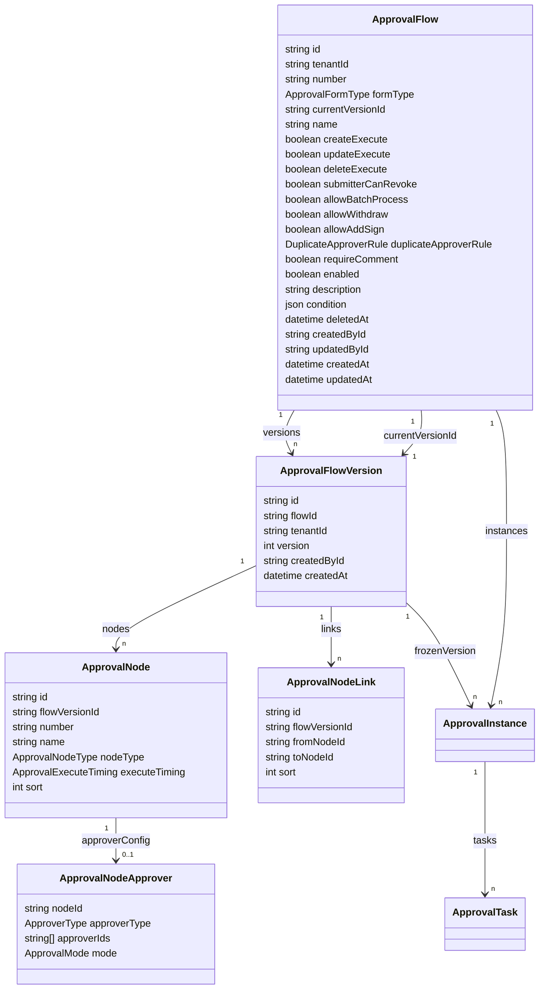

# 流程设置管理底座技术设计

## 1. 设计目标

W2.5 将当前“每个模块一张可覆盖保存的线性审批表单”升级为 Cordys 对应的信息架构和可演进底座：流程主记录负责业务属性，流程版本冻结节点定义，审批实例绑定提交时版本，同时保留 `nodesSnapshot` 作为运行时稳定输入。

本阶段只让已具备真实业务对象和审批入口的报价、合同、订单继续执行新建/提交审批。发票配置可以建立但不得启用；回款记录不再作为流程设置中的 Cordys 表单类型。更新/删除执行、高级节点与动作继续由暂缓台账约束。

## 2. UI 设计规格

### Purpose Statement

流程设置面向系统管理员，核心任务是快速判断“哪些业务启用了什么流程”，并安全地完成新建、查看、编辑、启停和删除。界面必须优先表达状态、执行时机和版本边界，避免把尚未接入运行时的选项表现为可用功能。

### Aesthetic Direction

采用工业化工具界面：高信息密度、明确分区、有限装饰和稳定操作位置。视觉上服从现有 MicroMatrix CRM 与 Cordys 管理页信息架构，不另起一套营销型视觉语言。

### Color Palette

- 主背景：`#FFFFFF`
- 页面底色：`#F5F7FA`
- 主文字：`#303133`
- 主操作：`#409EFF`
- 启用状态：`#67C23A`
- 警告/待接入：使用现有 Element Plus warning token

### Typography

沿用项目当前中文管理端字体栈和 Element Plus 字体 token，不引入网络字体。该选择是对通用 UI 规范字体建议的窄范围覆盖，原因是现有产品一致性和中文可用性优先。

### Layout Strategy

- 主页面使用“顶部操作/筛选带 + 全宽流程表格”的工作台布局。
- 新建、编辑和详情使用 `1080px` 的右侧宽抽屉，并在窄屏下由 Element Plus 自适应。
- 抽屉左侧为窄步骤导航，右侧为当前步骤内容，形成非对称主次层级；三个步骤语义与 Cordys 的“基础信息 / 流程设计 / 更多设置”一致。
- 流程设计采用 Vue Flow 纵向画布：开始节点、审批节点、结束节点；高级条件分支未实施前限制为受控线性图，不开放任意分支连线。
- 图标统一使用项目已有 `lucide-vue-next`，不使用 Emoji。

## 3. 模块边界

```mermaid
flowchart LR
    UI[流程设置列表与抽屉] --> API[ApprovalsController 配置接口]
    API --> FS[ApprovalFlowConfigService]
    FS --> F[(ApprovalFlow)]
    FS --> V[(ApprovalFlowVersion)]
    FS --> N[(Node / Approver / Link)]
    Runtime[现有审批运行时] --> Resolver[EnabledFlowResolver]
    Resolver --> F
    Resolver --> V
    Runtime --> I[(ApprovalInstance + nodesSnapshot)]
    I --> V
    Audit[操作日志] <-- API
```

### 后端职责拆分

- `ApprovalsController`：保留审批中心运行时接口，新增 REST 风格流程配置接口和四类权限门槛。
- `ApprovalFlowConfigService`：负责列表、详情、校验、编号、版本创建、启停、软删除和配置 VO 构建。
- `ApprovalsService`：继续负责提交、节点推进、通过/驳回和审批中心查询；通过统一解析器读取当前启用版本，不再直接读取可覆盖节点。
- `ApprovalFlowMapper`：集中完成 `quotation -> quote` 等配置表单类型与运行时业务对象类型映射，不让两套枚举散落在业务 Service。
- 现有 `BusinessNotificationsService`：保持审批结果事件行为，不在 W2.5 改变 32/35 消息基线。

前端拆为页面容器、流程抽屉、基础信息、Vue Flow 设计器、自定义节点和更多设置等职责组件，避免继续把全部状态写在一个 Vue 文件中。

### Vue Flow 集成边界

- 使用 `@vue-flow/core` 1.x；实施时以官方当前 1.48.x API 为基线。官方文档：[Vue Flow Guide](https://vueflow.dev/guide/)。
- 画布使用受控 `nodes/edges`，业务表单状态是唯一事实来源；不得把 Vue Flow store 或包含组件引用的原始对象发送到 API。
- 使用 `START / APPROVER / END` 三种自定义节点，通过 slot/component 显示节点名称、审批人摘要、会签/或签和操作入口。
- 使用 `@vue-flow/background` 与 `@vue-flow/controls` 提供网格背景、缩放和适配视口；W2.5 节点较少，不引入 MiniMap。
- W2.5 不允许用户创建任意边。新增、删除和拖动结束后按纵向位置重新计算审批节点顺序，再由应用重建唯一合法的线性边集合。
- 开始/结束节点不可删除；详情模式关闭拖动、连接、选择删除和节点操作。
- 保存前通过纯函数把 Vue Flow 节点转换为 `ApprovalNodeConfig[]`；加载时执行反向转换并生成稳定节点 ID 和布局位置。
- 所有适配器使用精确 TypeScript 类型；不通过 `any` 绕过 Vue Flow 泛型或事件类型。

## 4. 数据模型

### 4.1 核心关系



### 4.2 字段与约束

- `ApprovalFormType`：`QUOTATION / CONTRACT / INVOICE / ORDER`，API 使用小写值 `quotation / contract / invoice / order`。
- `ApprovalExecuteTiming`：`CREATE / UPDATE / DELETE`。W2.5 仅允许 `CREATE` 进入启用状态，另外两项先落字段但服务端拒绝开启。
- `ApprovalNodeType`：先使用 `START / APPROVER / END`；预留 `CONDITION / DEFAULT` 枚举，但 W2.5 DTO 不接受前端创建这两类节点。
- `DuplicateApproverRule`：`FIRST_ONLY / SEQUENTIAL_ALL / EACH`。W2.5 固定 `FIRST_ONLY`，其余值待高级运行时接入。
- `ApprovalFlow.number` 使用 `QTE-APV / CTR-APV / INV-APV / ORD-APV` 前缀及五位租户内序号。
- 新增 `ApprovalFlowNumberCounter`，以 `tenantId + formType` 唯一，事务内原子递增，避免并发下通过 `count + 1` 生成重复编号。
- `tenantId + number` 唯一。
- 通过迁移 SQL 建立 `tenantId + formType WHERE deletedAt IS NULL` 部分唯一索引，允许删除后重建同类型流程，同时允许保留多条历史软删除记录。
- `ApprovalFlowVersion` 使用 `flowId + version` 唯一；版本与节点只新增、不覆盖、不物理删除。
- `ApprovalNodeLink` 校验两端节点属于同一版本和同一执行时机。
- `ApprovalInstance` 新增可空的 `flowId`、`flowVersionId` 和 `executeTiming`。新实例三个字段必写；可空仅用于无法可靠回填的历史兼容记录。
- 保留 `ApprovalInstance.nodesSnapshot`。运行时继续以它推进节点，版本 ID 用于追踪来源，而不是在审批过程中重新读取最新配置。

### 4.3 线性图保存方式

前端 Vue Flow 画布会显示完整线性图，但提交时只发送有业务含义的审批节点。服务端不信任前端显示边，而是为每个 `CREATE` 配置自动补齐 `START` 与 `END`，并按顺序生成连接：

```text
START -> APPROVER_1 -> APPROVER_2 -> ... -> END
```

审批人配置拆入一对一扩展表。这样 W2.5 的简单编辑器保持轻量，后续条件节点、抄送和节点后置动作可以在相同图结构上扩展。

## 5. 共享契约与兼容策略

### 5.1 枚举分层

- 新增 `ApprovalFormType`，只服务流程配置：`quotation / contract / invoice / order`。
- 现有 `ApprovalModule` 暂时作为审批实例资源类型保留，以读取历史 `quote / contract / order / receivableRecord` 实例。
- 新增唯一映射：`quotation -> quote`、`contract -> contract`、`order -> order`；`invoice` 在 DB-003 完成前没有运行时映射。
- 新提交不再接受 `receivableRecord`；历史实例仍可在审批中心查看，避免破坏审计记录。

### 5.2 旧配置迁移

迁移脚本执行以下步骤：

1. 为现有 `quote / contract / order` 流程映射目标 `formType`，补编号、执行时机、审计和软删除字段。
2. 每条流程创建版本 `1`，把原审批节点迁入该版本，节点类型为 `APPROVER`、执行时机为 `CREATE`。
3. 为每个版本补 `START/END` 和线性连接，原审批人字段迁入 `ApprovalNodeApprover`。
4. 现有实例根据租户和模块尽量回填 `flowId/flowVersionId`，原 `nodesSnapshot` 不改写。
5. `receivableRecord` 配置停用并软删除；历史实例和任务保留，但不再允许发起新审批。
6. 角色中原有 `approval:flowManage` 权限迁移为新的读取、新增、更新、删除权限，随后旧权限码只保留一个发布周期的兼容识别，不再用于页面按钮。

迁移应可重复检测已完成状态，禁止重复创建版本、起止节点或权限关系。

## 6. API 设计

配置接口统一位于 `/approvals/flows`：

| 方法   | 路径                           | 权限                    | 说明                                       |
| ------ | ------------------------------ | ----------------------- | ------------------------------------------ |
| GET    | `/approvals/flows`             | `system:process`        | 分页、关键字、类型、状态、排序             |
| GET    | `/approvals/flows/:id`         | `system:process`        | 当前版本详情                               |
| POST   | `/approvals/flows`             | `system:process:add`    | 新建主记录、首版本和线性图                 |
| PUT    | `/approvals/flows/:id`         | `system:process:update` | 更新基础设置；节点变化时创建新版本         |
| PATCH  | `/approvals/flows/:id/enabled` | `system:process:update` | 独立启停                                   |
| DELETE | `/approvals/flows/:id`         | `system:process:delete` | 仅禁用流程可软删除，并终止审批中的关联实例 |

### 6.1 列表查询

查询参数：`page`、`pageSize`、`keyword`、`formType`、`enabled`、`sortBy`、`sortOrder`。`sortBy` 使用白名单 `number/name/formType/enabled/createdAt/updatedAt`，默认 `updatedAt desc`。

响应使用项目统一 `PaginatedResult<ApprovalFlowListItem>`；用户名称由服务端批量查询后填充，不把用户表关系暴露给前端拼接。

### 6.2 新增/更新 DTO

基础字段包括：`name`、`formType`、`description`、`enabled`、三个执行时机、更多设置和 `createNodeConfig`。节点 DTO 继续支持当前四类审批人和 `ALL/ANY`；成员/角色 ID 必须属于当前租户。

规则：

- 新增名称长度 `1..255`，描述不超过 `1000`。
- 新增后 `formType` 不可修改。
- 启用时必须为 `quotation / contract / order`、必须开启 `createExecute`，且至少有一个有效审批节点。
- `invoice` 可保存禁用配置，但启用返回 `409`，错误信息明确指向 DB-003 对应业务链路尚未完成。
- W2.5 请求若将 `updateExecute/deleteExecute` 设为 `true`，返回 `422`；前端也保持禁用状态。
- 指定成员/角色节点必须至少有一个有效 ID；直属上级和部门主管节点忽略 `approverIds`。
- 更新只在规范化节点定义确实变化时创建新版本；仅改名、描述、启用状态和更多设置不产生空版本。

### 6.3 启停与删除

- 启用前执行与新增相同的可运行性校验。
- 停用只影响后续提交，不改变现有实例。
- 删除启用流程返回 `409`。
- 删除事务中设置 `deletedAt/updatedById`，把关联 `PENDING` 实例改为 `CANCELED`、待办改为 `SKIPPED`，并把对应报价/合同/订单的业务审批状态恢复为 `NONE`。
- 已完成实例、任务、版本与操作日志全部保留。

## 7. 页面与交互

### 7.1 流程列表

- 工具栏左侧为“新建流程”，右侧为关键字、表单类型、启用状态和刷新。
- 表格列与 Cordys 对应：序号、流程编号、表单类型、流程名称、启用状态、执行时机、创建人/时间、更新人/时间、操作。
- 名称点击进入只读详情；更新权限用户可快捷改名或进入编辑抽屉。
- 状态开关在确认后调用独立接口，失败时恢复原状态。
- 启用流程的删除按钮仍可见但点击后解释原因；无删除权限时不显示操作。
- 发票行显示“业务链路待接入”，且启用开关不可操作。

### 7.2 流程抽屉

三个步骤：

1. **基础信息**：表单类型、流程名称、执行时机、描述。编辑模式锁定表单类型；`UPDATE/DELETE` 显示“后续接入”并禁用。
2. **流程设计**：Vue Flow 纵向受控画布，使用开始/审批/结束自定义节点；审批节点保留当前成员/角色/部门负责人/直属上级以及会签/或签。节点拖动用于调整纵向顺序，边由应用自动重建；金额门槛作为“简化入口条件”保留，明确属于阶段性兼容能力。
3. **更多设置**：提交人撤销根据真实运行时开放；批量、撤回、加签、重复审批人高级规则和必填意见先展示源码字段与默认值，但禁用并标注后续阶段。

新建和编辑关闭时比较规范化表单快照；有修改则弹确认。详情模式不加载成员/角色选项的编辑能力，只显示已解析名称。

## 8. 权限与审计

新增权限：

- `system:process`
- `system:process:add`
- `system:process:update`
- `system:process:delete`

权限树把三个动作挂在读取权限下；系统管理员默认拥有全部权限。流程设置菜单和路由使用 `system:process`，审批中心仍使用 `menu:approval`，两者不互相替代。

所有写操作使用现有 `LogOperation`，资源类型统一为 `approvalFlow`，动作拆分为 `add/update/enable/disable/delete`。更新日志记录基础字段差异和新旧版本号，不记录完整成员隐私载荷。

## 9. 一致性与错误处理

- 所有详情和写查询必须包含 `tenantId + id + deletedAt IS NULL`。
- 新增、版本更新和删除使用数据库事务。
- 并发新增依赖部分唯一索引最终裁决，服务层捕获唯一冲突并返回 `409`。
- 节点变更使用规范化结构比较：去除临时 ID，按顺序保留名称、审批人类型、去重排序后的审批人 ID 和模式。
- 版本创建成功但主表切换失败时整笔事务回滚。
- 列表和详情只返回当前版本；历史版本暂不提供公开管理 API，但数据库完整保留。
- 不通过删除或重建流程绕过审批中实例保护；只有先停用再删除。

## 10. 测试策略

### 单元与规则测试

- 表单类型映射、编号前缀、规范化节点比较。
- 名称、描述、执行时机、发票启用、成员/角色租户归属校验。
- 四类权限与旧权限迁移规则。
- 启用流程删除拒绝、禁用流程软删除。

### 服务集成与 Smoke

- 同租户同类型并发创建只有一个成功；不同租户互不影响。
- 新建生成版本 1；仅改名不新增版本；节点变化生成版本 2。
- 新实例绑定当前版本；流程更新后旧实例的 `flowVersionId/nodesSnapshot` 不变。
- 报价、合同、订单提交、会签/或签、通过、驳回、撤销继续工作。
- 删除流程终止待处理实例并恢复业务审批状态。
- `receivableRecord` 不再能新提交，但历史实例仍可读取。
- 发票流程可禁用保存、不可启用。
- 无权限请求返回 `403`，跨租户详情与写入返回 `404`。

### 浏览器验收

- 列表筛选、分页、改名、启停、删除拦截。
- 新建/编辑/详情抽屉、未保存离开提示、成员和角色节点保存。
- Vue Flow 节点新增、删除、拖动排序、缩放、适配视口和只读模式行为正确；刷新后图结构与服务端版本一致。
- 刷新后流程编号、当前版本和节点配置保持一致。
- 发票、更新/删除执行时机和高级设置均明确显示不可用原因。
- 控制台无新增 error/warn，相邻审批中心流程仍可完成一次真实审批。

## 11. 文档与交付

实施完成时同步：

- `docs/api.md`
- `docs/data-model.md`
- `docs/cordys-parity.md`
- `docs/cordys-menu-parity.md`
- `docs/alignment-log.md`
- `docs/cordys-wave2-execution-plan.md`
- `docs/cordys-deferred-backlog.md`

DB-009 只有在主表、版本、基础节点图、迁移、API、页面和测试全部完成后才能标记 `VERIFIED`。DB-003、DB-010、DB-011、DB-012 继续保持未完成状态。
