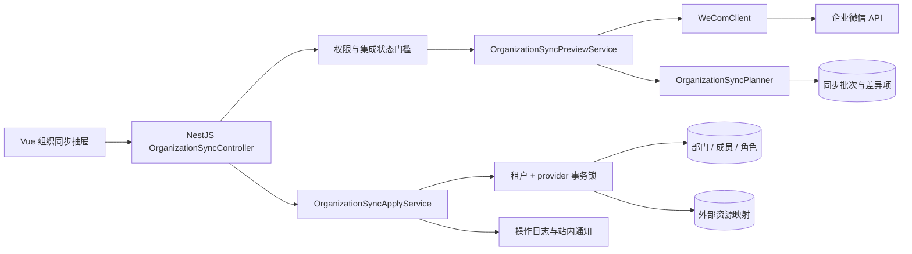
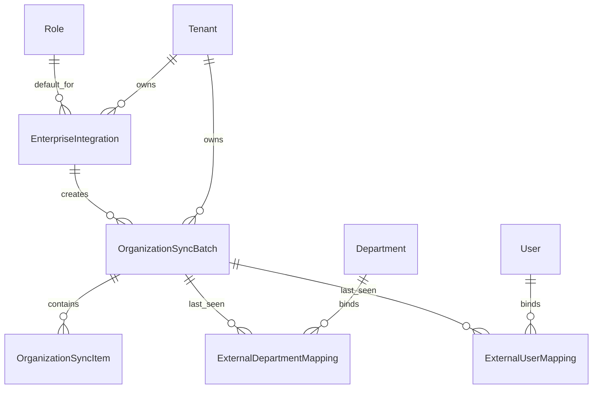

# W3.2 企业微信组织同步技术设计

## 1. 设计目标与边界

本设计在 W3.1 企业微信配置、Secret 加密和连接测试底座之上，实现“读取企业微信组织数据 → 生成差异预览 → 处理冲突 → 原子应用 → 审计和通知”的完整闭环。

CordysCRM 源码是行为基线：保留独立同步权限、配置与测试门槛、租户级并发控制、企业微信部门/成员接口、外部 ID 持续匹配、缺失外部成员禁用、操作日志和成功通知。唯一重要调整是首次同步不直接删除本地组织数据，而是先生成可确认的预览，只修改已经映射或管理员明确确认的资源。

W3.2 阶段当时不实现企业微信 OAuth 登录、扫码绑定、消息推送和定时自动同步。其后 W3.3 已完成前三项；定时/增量组织同步仍保留到后续阶段。

## 2. Cordys 源码对照

| 能力           | Cordys 源码位置                                                | MicroMatrix 设计                                                |
| -------------- | -------------------------------------------------------------- | --------------------------------------------------------------- |
| 同步入口与权限 | `UserSyncController`，`SYS_ORGANIZATION:SYNC`                  | 组织架构页入口，权限码 `system:dept:sync`                       |
| 同步门槛       | `orgTable.vue` 检查配置、验证、启用与同步中状态                | 同样检查配置、最近测试、同步开关和活动批次                      |
| 并发控制       | `ThirdDepartmentService` 的租户级 Redisson 锁和 Redis 状态     | PostgreSQL 活动批次唯一索引 + transaction advisory lock         |
| 数据获取       | `WeComDepartmentService` 调用 `/department/list`、`/user/list` | `WeComClient` 增加白名单解析后的部门与成员快照接口              |
| 外部匹配       | `Department.resourceId`、`OrganizationUser.resourceUserId`     | 独立的部门映射、成员映射表，按 tenant/provider/externalKey 唯一 |
| 首次同步       | 删除原部门和成员后重建                                         | 有意调整为差异预览，保留本地手工资源和业务引用                  |
| 后续同步       | 更新/新增，企微缺失成员禁用                                    | 更新/新增；仅禁用已映射且本次缺失的成员                         |
| 完成处理       | 清缓存、操作日志、站内通知                                     | 数据提交后写日志和站内通知；现有查询不依赖 Redis 缓存           |

### 2.1 源码问题的有意修正

Cordys `WeComDepartmentService` 使用 `is_leader_in_dept.indexOf(departmentId) > 0` 判断负责人，无法正确表达企业微信返回的两个平行数组，并可能漏掉数组首项。MicroMatrix 按成员 `department[index]` 与 `is_leader_in_dept[index] === 1` 配对解析。这是对明显实现缺陷的修正，不是业务规则变更。

## 3. UI DESIGN SPECIFICATION

### 3.1 Purpose statement

界面服务于组织管理员：在不破坏现有 CRM 负责人、角色和审批数据的前提下，看清企业微信将带来的组织变更，并完成一次可追溯的同步。

### 3.2 Aesthetic direction

采用 **Industrial / utilitarian** 方向：信息密度适中、状态明确、操作克制，以差异表格和风险提示为核心，不增加装饰性大卡片或营销式视觉。继续遵循现有 Element Plus 管理后台视觉，保证企业设置和组织架构页面一致。

### 3.3 Palette

现有项目设计系统优先于通用 UI 指南，使用 Element Plus 语义变量；以下颜色是设计和测试基准：

- 主操作 / 已映射：`#409EFF`
- 成功 / 不变：`#67C23A`
- 警告 / 待处理：`#E6A23C`
- 失败 / 禁用 / 冲突：`#F56C6C`
- 页面弱背景：`#F5F7FA`

深色模式继续使用同名 Element Plus CSS variables，不在组件中硬编码第二套颜色。

### 3.4 Typography

沿用项目已定义的中文系统字体栈，不引入外部字体资源：

```css
'Helvetica Neue', Helvetica, 'PingFang SC', 'Hiragino Sans GB',
'Microsoft YaHei', Arial, sans-serif
```

页面标题 18px/600，区块标题 15px/600，正文和表格 14px/400，辅助说明 13px/400。数字统计使用同一字体栈的 20px/600，避免引入与现有后台不一致的展示字体。

### 3.5 Layout strategy

- 企业设置继续使用现有企业微信卡片，在卡片底部提供“同步组织架构”开关和状态说明；开启时要求选择“新成员默认角色”。
- 组织架构页保留左侧 240px 部门树和右侧成员表格，在右侧表格工具栏新增“企业微信同步”次要按钮，不新增左侧菜单项。
- 同步详情使用右侧 `760px` 抽屉。抽屉顶部是紧凑的阶段条与最近批次信息，中部为不对称的“左侧统计摘要 / 右侧主差异表”布局，底部固定主要操作区。
- 视口小于 1100px 时抽屉宽度使用 `92vw`，统计摘要改为横向换行；本阶段仍是 PC 管理功能，不新增移动端入口。
- 危险确认不使用居中大面积视觉；只有最终“应用同步”使用警告确认框，并显示将新增、更新、禁用的准确数量。

### 3.6 页面状态

同步抽屉使用以下阶段，不允许用户跳步：

1. **未生成预览**：说明同步规则，选择默认角色，按钮“生成预览”。
2. **正在获取**：展示进度状态，禁止重复生成或应用。
3. **待处理**：展示统计、差异列表和冲突项；冲突可“绑定现有资源”或“跳过”。
4. **可应用**：冲突全部解决后启用“应用同步”。
5. **正在应用**：锁定表单并轮询批次状态。
6. **已完成 / 失败**：展示安全错误摘要和逐项结果；成功后刷新部门树与成员列表。

空状态使用简短文本和普通图标，不使用超大字符占位。错误必须保留当前预览，除非凭据版本已变化导致批次失效。

## 4. 总体架构



### 4.1 模块职责

- `EnterpriseIntegrationsService`：保存同步开关、默认角色、凭据版本和最近同步摘要。
- `WeComClient`：获取 token、部门列表和各部门直属成员；只返回规范化 DTO，不向上暴露 token 或原始响应。
- `OrganizationSyncPreviewService`：创建批次、获取快照、处理重复数据、调用差异规划器并保存预览。
- `OrganizationSyncPlanner`：纯计算组件，按映射优先级生成动作、冲突和统计，便于规则单测。
- `OrganizationSyncResolutionService`：校验绑定目标租户、类型和唯一性，保存管理员选择。
- `OrganizationSyncApplyService`：校验批次仍有效，按拓扑顺序在单一事务中应用全部动作。
- `OrganizationSyncController`：只负责鉴权、DTO 校验和调用服务，不承载同步算法。

## 5. 数据模型



### 5.1 现有模型调整

#### `EnterpriseIntegration`

新增：

- `credentialVersion Int @default(1)`：corpId、agentId 或 Secret 变化时递增；预览保存该版本，应用时必须一致。
- `syncDefaultRoleId String?`：同步创建新成员时使用，由开启同步的管理员明确选择。
- `lastSyncStatus OrganizationSyncStatus?`
- `lastSyncMessage String?`
- `lastSyncedAt DateTime?`

凭据变化继续自动关闭 `syncEnabled`、清空测试结果，并把该集成所有 `PREVIEW_READY` 批次置为 `INVALIDATED`。仅切换同步开关不递增 `credentialVersion`。

#### `User`

新增 `passwordLoginEnabled Boolean @default(true)`。企微同步创建的成员设为 `false`，在 W3.3 建立外部身份登录前，即使管理员误重置占位账号密码也不能通过普通密码登录。只有密码登录入口检查该字段，refresh token 不检查，避免 W3.3 外部身份登录获得的会话被错误阻断；现有本地成员保持 `true`。

### 5.2 新增模型

#### `ExternalDepartmentMapping`

- `id`, `tenantId`, `provider`
- `externalId`：保留企业微信原值
- `externalKey`：用于匹配的规范化值
- `departmentId`
- `active Boolean @default(true)`
- `lastSeenBatchId`, `createdAt`, `updatedAt`
- 唯一：`[tenantId, provider, externalKey]`
- 唯一：`[tenantId, provider, departmentId]`

#### `ExternalUserMapping`

- `id`, `tenantId`, `provider`
- `externalId`, `externalKey`, `userId`
- `active Boolean @default(true)`
- `lastSeenBatchId`, `createdAt`, `updatedAt`
- 唯一：`[tenantId, provider, externalKey]`
- 唯一：`[tenantId, provider, userId]`

#### `OrganizationSyncBatch`

- `id`, `tenantId`, `integrationId`, `provider`
- `status`：`FETCHING | PREVIEW_READY | APPLYING | SUCCEEDED | FAILED | INVALIDATED`
- `credentialVersion`
- `counts Json`：`create/update/disable/unchanged/conflict/skip/failed`
- `errorCode`, `errorMessage`：只保存安全摘要
- `createdById`, `appliedById?`
- `fetchStartedAt`, `previewedAt`, `applyStartedAt`, `finishedAt`, `createdAt`, `updatedAt`

数据库迁移增加 PostgreSQL partial unique index：同一 `tenantId + provider` 在 `FETCHING` 或 `APPLYING` 状态只能有一个批次。服务层同时使用 transaction advisory lock，避免状态切换竞态。

#### `OrganizationSyncItem`

- `id`, `tenantId`, `batchId`
- `resourceType`：`DEPARTMENT | USER`
- `externalId`, `externalKey`
- `action`：`CREATE | UPDATE | DISABLE | UNCHANGED | CONFLICT | SKIP`
- `result`：`PENDING | RESOLVED | APPLIED | SKIPPED | FAILED`
- `localId?`, `parentExternalKey?`
- `sourceData Json`：仅规范化白名单字段
- `changes Json?`：字段级 `before/after`
- `conflictType?`, `conflictMessage?`
- `resolution`：`BIND | SKIP`，以及 `resolvedLocalId?`
- `errorMessage?`, `sort`, `createdAt`, `updatedAt`
- 唯一：`[batchId, resourceType, externalKey]`

### 5.3 白名单快照

部门只保存：`id/name/parentId/order/isRoot`。成员只保存：`userId/name/email/mobile/position/mainDepartmentId/isLeader`。不保存 Secret、access token、原始响应、头像二进制或企业微信未使用字段。

缺失邮箱使用稳定占位：`wecom+<tenantHash>+<userHash>@local.invalid`。散列输入包含 tenantId 和外部 userId，不暴露原始 userId，并在重复预览中保持一致。当前项目的邮箱在全库唯一；若企微邮箱已被其他租户占用，它同样视为不可用于当前租户，并静默改用占位邮箱，不能把跨租户记录暴露为可绑定冲突。密码使用密码学安全随机值生成后只保存 bcrypt hash。

## 6. 差异与应用算法

### 6.1 预览生成

1. 校验 `system:dept:sync`、已配置、最近测试成功、`syncEnabled=true`、默认角色存在且可分配。
2. 创建 `FETCHING` 批次并记录当前 `credentialVersion`。
3. 解密 Secret，在内存中获取 token；拉取全部可见部门，再按部门拉取直属成员。
4. 规范化外部 ID；部门按 ID 去重，成员按 userId 去重并以 `main_department` 决定唯一归属部门。
5. 校验只有一个根部门、父节点完整、部门树无环；空部门列表或重复外部 ID 直接使批次失败。
6. 批量读取当前租户部门、成员和映射，调用纯函数规划差异。
7. 保存白名单差异项与统计，批次转为 `PREVIEW_READY`。

拉取成员使用最大并发 5、单请求 8 秒超时，并对企业微信限流或临时错误做最多 2 次指数退避重试。任何一个部门读取失败都不生成部分可应用预览。

### 6.2 匹配优先级

部门：

1. 外部部门映射；
2. 企微根部门固定绑定本地唯一根部门；
3. 同一已解析父部门下的本地同名部门只生成冲突，不自动绑定；
4. 否则 `CREATE`。

成员：

1. 外部成员映射；
2. 本租户邮箱碰撞；
3. 本租户手机号碰撞；
4. 碰撞只生成冲突，不自动绑定；
5. 否则 `CREATE`。

同一项目被邮箱和手机号指向不同本地成员时标记不可自动解决冲突，管理员只能选择一个有效本地成员或跳过。

### 6.3 应用顺序

应用前再次校验权限、同步开关、默认角色、批次状态和 `credentialVersion`。在单一 Prisma interactive transaction 中：

1. 获取 `tenantId + provider` advisory lock，并把批次原子更新为 `APPLYING`。
2. 按父子拓扑顺序应用部门，根部门只更新名称/排序并创建映射。
3. 应用成员和默认角色；已映射成员保留原角色集合，新成员创建默认角色关系。
4. 所有成员落库后，统一计算并更新部门主管。
5. 将本次未出现但仍有效的外部成员映射置为 inactive，并禁用对应成员；清理其 `Department.leaderId` 和其他成员的 `leaderId`，保留业务 owner 与审批历史。
6. 将本次未出现的部门映射置为 inactive，保留本地部门。
7. 写入逐项结果、批次统计和集成最近同步状态，事务提交。
8. 提交后写操作日志并向应用人发送站内通知；通知失败只记录日志，不回滚已完成组织同步。

事务发生不可恢复错误时，组织、成员、角色、映射和批次的应用结果全部回滚；随后用独立安全更新把批次标记为 `FAILED`。重复提交 `SUCCEEDED` 批次返回原结果，其他非 `PREVIEW_READY` 状态拒绝应用。

## 7. API 设计

| Method | Path                                               | Permission              | 用途                             |
| ------ | -------------------------------------------------- | ----------------------- | -------------------------------- |
| `PUT`  | `/enterprise-integrations/wecom/sync`              | `system:setting:update` | 设置同步开关和默认角色           |
| `GET`  | `/organization-sync/wecom/status`                  | `system:dept:sync`      | 获取门槛、活动批次和最近批次摘要 |
| `POST` | `/organization-sync/wecom/previews`                | `system:dept:sync`      | 创建差异预览                     |
| `GET`  | `/organization-sync/wecom/batches`                 | `system:dept:sync`      | 分页读取历史批次                 |
| `GET`  | `/organization-sync/wecom/batches/:id`             | `system:dept:sync`      | 读取批次统计与状态               |
| `GET`  | `/organization-sync/wecom/batches/:id/items`       | `system:dept:sync`      | 按资源、动作分页读取差异         |
| `PUT`  | `/organization-sync/wecom/batches/:id/resolutions` | `system:dept:sync`      | 批量提交冲突解决方案             |
| `POST` | `/organization-sync/wecom/batches/:id/apply`       | `system:dept:sync`      | 原子应用已确认预览               |

所有 `:id` 查询必须同时包含当前 `tenantId`；找不到其他租户记录时统一返回 404，不暴露记录是否存在。列表 DTO 不返回 `sourceData` 之外的上游内容。

## 8. 权限与操作闭环

- 新增动作权限 `system:dept:sync`，归属组织架构权限树；管理员 `*` 自动拥有，迁移仅给当前系统管理员角色追加该权限，不自动授权普通角色。
- `system:setting:update` 管理配置、Secret、同步开关和默认角色；它不隐含执行组织同步权限。
- 企业微信卡片开关只有最近连接测试成功时可开启。开启弹层要求选择默认角色，并说明“仅用于新同步成员，已存在成员角色不会被覆盖”。
- 组织架构页面按钮按 Cordys 行为提供明确禁用原因：未配置、待验证、同步未开启、未选择默认角色、正在获取、正在应用。
- 创建预览、处理冲突、应用同步分别记录操作日志；Secret、token 和完整上游错误不得进入日志详情。

## 9. 错误与安全策略

- 企业微信错误只映射为内部错误码和截断后的安全中文说明；URL query 不进入日志，避免 token 泄漏。
- 对外错误示例：`WECOM_NOT_CONFIGURED`、`WECOM_NOT_VERIFIED`、`SYNC_DISABLED`、`SYNC_BUSY`、`SNAPSHOT_INVALID`、`PREVIEW_INVALIDATED`、`UNRESOLVED_CONFLICTS`。
- 配置变更使待应用批次失效；页面必须提示重新生成预览，不允许继续使用旧快照。
- 所有外部字符串在 DTO 层限制长度；邮箱、手机号和名称经过 trim，空字符串转换为 null。
- 差异 JSON 只由服务端从白名单字段构造，客户端不能提交或覆盖 source snapshot。

## 10. 测试与验证

### 10.1 单元与服务测试

- WeCom 响应解析：部门树、主部门去重、负责人平行数组、超时、限流、重复 ID、空部门。
- 规划器：映射优先、根部门绑定、同级同名、邮箱/手机号冲突、CREATE/UPDATE/DISABLE/UNCHANGED。
- 解决方案：跨租户绑定、重复绑定、错误资源类型、跳过、全部冲突已解决判断。
- 应用服务：父子顺序、默认角色、占位邮箱稳定性、角色保留、主管更新、缺失成员禁用、部门映射失效、事务回滚和幂等。
- 安全：普通密码登录关闭、Secret/token 不出现在响应和日志、所有查询限定 tenantId。

### 10.2 集成与页面验收

- PostgreSQL 迁移可从当前 schema 前进和回滚；partial unique index 能阻止同租户并发活动批次。
- 企微卡片可开启/关闭同步并选择默认角色；配置变化自动关闭同步。
- 组织架构页在各种门槛状态下显示正确按钮或禁用原因。
- 从预览到解决冲突再到应用完整走通；成功后部门树、成员表、日志和通知同步刷新。
- 通过 typecheck、lint、build、规则测试、Smoke，并使用本地页面完成浏览器操作验收。

## 11. 已知后续缺口

- **DB-014 / W3.3（已完成）**：已实现企微 userid 外部身份登录、绑定/恢复、安全解绑和登录审计；unionid/open_userid 迁移策略仍由后续 provider 演进处理。
- **DB-006 / W3.3（已完成）**：已实现企业微信文本消息发送、渠道启停、失败重试和投递结果审计。
- **组织模型增强**：当前成员只支持一个主部门。企微多部门成员在 W3.2 按 `main_department` 同步；若完整复刻副部门关系，需要后续增加 `UserDepartment` 多对多模型。
- **自动同步**：定时任务、失败自动重试和增量回调不在 W3.2；本阶段只支持管理员手工同步。
- **钉钉/飞书**：映射和批次模型已按 provider 抽象，但客户端和页面未实现。

这些缺口必须继续保留在 Cordys 差距登记中，不能因为 W3.2 完成而标记为已复刻。
